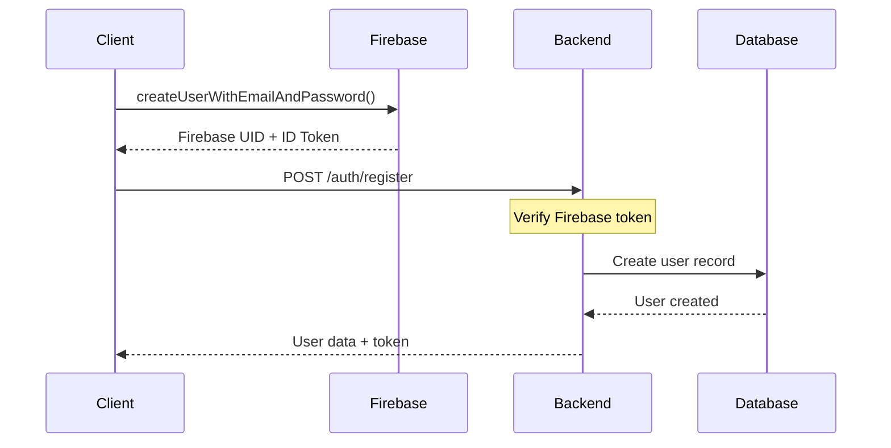
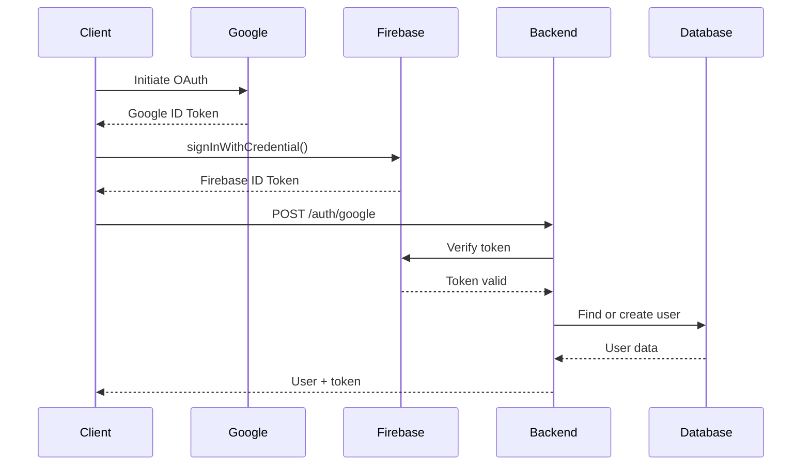
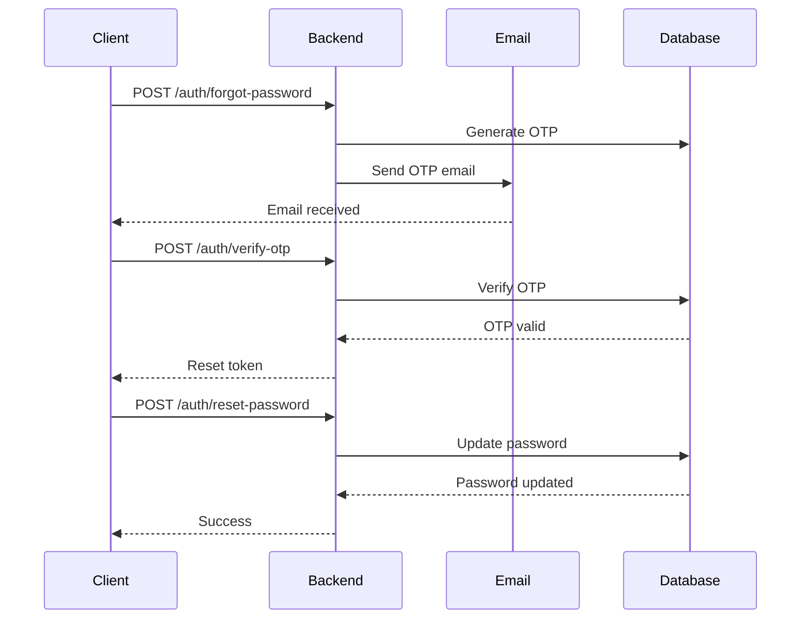

# Advanced API Guide - Luxury Fashion Platform

Extended API documentation with testing examples, WebSocket endpoints, and advanced features.

---

## Table of Contents

1. [Authentication Flows](#authentication-flows)
2. [API Testing Examples](#api-testing-examples)
3. [File Upload Specifications](#file-upload-specifications)
4. [WebSocket Endpoints](#websocket-endpoints)
5. [Batch Operations](#batch-operations)
6. [Search & Filtering](#search--filtering)
7. [Caching Strategy](#caching-strategy)
8. [Security Best Practices](#security-best-practices)
9. [Performance Optimization](#performance-optimization)
10. [Postman Collection](#postman-collection)

---

## Authentication Flows

### 1. Email/Password Registration Flow



**cURL Example:**

```bash
# Step 1: Register with Firebase (client-side)
# This returns a Firebase ID token

# Step 2: Complete registration with backend
curl -X POST https://api.luxuryfashion.com/v1/auth/register \
  -H "Content-Type: application/json" \
  -H "Authorization: Bearer <firebase_id_token>" \
  -d '{
    "email": "user@example.com",
    "full_name": "Nguyen Van A"
  }'
```

**Response:**

```json
{
  "success": true,
  "data": {
    "user": {
      "id": "550e8400-e29b-41d4-a716-446655440000",
      "email": "user@example.com",
      "full_name": "Nguyen Van A",
      "created_at": "2025-12-29T10:00:00Z"
    },
    "token": "eyJhbGciOiJSUzI1NiIsInR5cCI6IkpXVCJ9..."
  }
}
```

---

### 2. Google OAuth Flow



**cURL Example:**

```bash
curl -X POST https://api.luxuryfashion.com/v1/auth/google \
  -H "Content-Type: application/json" \
  -d '{
    "id_token": "google_id_token_here"
  }'
```

---

### 3. Password Reset Flow



---

## API Testing Examples

### Using cURL

#### 1. Get Products with Filters

```bash
curl -X GET "https://api.luxuryfashion.com/v1/products?category=clothing&sort=price_asc&page=1&limit=12" \
  -H "Accept: application/json"
```

#### 2. Add Item to Cart (Authenticated)

```bash
curl -X POST https://api.luxuryfashion.com/v1/cart/items \
  -H "Content-Type: application/json" \
  -H "Authorization: Bearer <firebase_token>" \
  -d '{
    "product_id": "550e8400-e29b-41d4-a716-446655440000",
    "quantity": 2,
    "size": "M"
  }'
```

#### 3. Create Order

```bash
curl -X POST https://api.luxuryfashion.com/v1/orders \
  -H "Content-Type: application/json" \
  -H "Authorization: Bearer <firebase_token>" \
  -d '{
    "shipping_address": {
      "full_name": "Nguyen Van A",
      "phone": "0901234567",
      "address": "123 Nguyen Hue, District 1",
      "city": "Ho Chi Minh City",
      "district": "District 1",
      "ward": "Ben Nghe Ward",
      "postal_code": "700000"
    },
    "payment_method": "cod",
    "discount_code": "WELCOME10",
    "notes": "Please call before delivery"
  }'
```

#### 4. Upload Product Images (Admin)

```bash
curl -X POST https://api.luxuryfashion.com/v1/admin/products \
  -H "Authorization: Bearer <admin_token>" \
  -F "name=Elegant Silk Shirt" \
  -F "description=Crafted with intention." \
  -F "category=clothing" \
  -F "subcategory=shirts" \
  -F "price=1200000" \
  -F "sizes=[{\"size\":\"S\",\"stock\":10},{\"size\":\"M\",\"stock\":15}]" \
  -F "images=@/path/to/image1.jpg" \
  -F "images=@/path/to/image2.jpg" \
  -F "images=@/path/to/image3.jpg"
```

---

### Using JavaScript (Axios)

```javascript
import axios from "axios";

const API_BASE_URL = "https://api.luxuryfashion.com/v1";

// Create API client
const apiClient = axios.create({
  baseURL: API_BASE_URL,
  headers: {
    "Content-Type": "application/json",
  },
});

// Add auth interceptor
apiClient.interceptors.request.use((config) => {
  const token = localStorage.getItem("firebase_token");
  if (token) {
    config.headers.Authorization = `Bearer ${token}`;
  }
  return config;
});

// Example: Get products
async function getProducts(filters) {
  try {
    const response = await apiClient.get("/products", {
      params: {
        category: filters.category,
        page: filters.page || 1,
        limit: filters.limit || 12,
        sort: filters.sort || "newest",
      },
    });
    return response.data;
  } catch (error) {
    console.error("Error fetching products:", error);
    throw error;
  }
}

// Example: Add to cart
async function addToCart(productId, quantity, size) {
  try {
    const response = await apiClient.post("/cart/items", {
      product_id: productId,
      quantity,
      size,
    });
    return response.data;
  } catch (error) {
    console.error("Error adding to cart:", error);
    throw error;
  }
}

// Example: Create order
async function createOrder(orderData) {
  try {
    const response = await apiClient.post("/orders", orderData);
    return response.data;
  } catch (error) {
    console.error("Error creating order:", error);
    throw error;
  }
}
```

---

## File Upload Specifications

### 1. Product Images

**Endpoint:** `POST /admin/products` or `PUT /admin/products/:id`

**Specifications:**

- **Format**: JPEG, PNG, WebP
- **Max size**: 5MB per image
- **Max files**: 10 images per product
- **Recommended dimensions**: 1200x1600px (3:4 ratio)
- **Auto-processing**:
  - Generate thumbnails (300x400px)
  - Convert to WebP
  - Optimize quality (85%)

**Example:**

```javascript
const formData = new FormData();
formData.append("name", "Elegant Silk Shirt");
formData.append("price", "1200000");
formData.append("category", "clothing");

// Add multiple images
const imageFiles = document.getElementById("images").files;
for (let i = 0; i < imageFiles.length; i++) {
  formData.append("images", imageFiles[i]);
}

const response = await fetch("/admin/products", {
  method: "POST",
  headers: {
    Authorization: `Bearer ${adminToken}`,
  },
  body: formData,
});
```

---

### 2. User Avatar

**Endpoint:** `PUT /users/me/avatar`

**Specifications:**

- **Format**: JPEG, PNG
- **Max size**: 2MB
- **Recommended dimensions**: 400x400px (1:1 ratio)
- **Auto-processing**:
  - Crop to square
  - Resize to 400x400px
  - Generate thumbnail (100x100px)

**Example:**

```javascript
const formData = new FormData();
formData.append("avatar", avatarFile);

const response = await apiClient.put("/users/me/avatar", formData, {
  headers: {
    "Content-Type": "multipart/form-data",
  },
});
```

---

### 3. AI Try-On Images

**Endpoint:** `POST /ai-tryon/generate`

**Specifications:**

- **User photo**:
  - Format: JPEG, PNG
  - Max size: 5MB
  - Recommended: Full body photo, clear background
  - Min dimensions: 512x768px
- **Processing**: Async (returns job_id)

**Example:**

```javascript
const formData = new FormData();
formData.append("user_image", userPhotoFile);
formData.append("product_ids", JSON.stringify([productId1, productId2]));

const response = await apiClient.post("/ai-tryon/generate", formData, {
  headers: {
    "Content-Type": "multipart/form-data",
  },
});

// Response: { job_id: "...", status: "processing" }

// Poll for status
const checkStatus = async (jobId) => {
  const statusResponse = await apiClient.get(`/ai-tryon/status/${jobId}`);
  return statusResponse.data;
};
```

---

## WebSocket Endpoints

### Connection

**URL:** `wss://api.luxuryfashion.com/ws`

**Authentication:**

```javascript
const socket = new WebSocket("wss://api.luxuryfashion.com/ws");

socket.onopen = () => {
  // Authenticate
  socket.send(
    JSON.stringify({
      type: "auth",
      token: firebaseToken,
    })
  );
};
```

---

### 1. Real-time Notifications

**Subscribe:**

```javascript
socket.send(
  JSON.stringify({
    type: "subscribe",
    channel: "notifications",
  })
);
```

**Receive:**

```javascript
socket.onmessage = (event) => {
  const message = JSON.parse(event.data);

  if (message.type === "notification") {
    console.log("New notification:", message.data);
    // {
    //   id: "...",
    //   type: "order_shipped",
    //   title: "Order Shipped",
    //   message: "Your order #ORD-001 has been shipped",
    //   created_at: "2025-12-29T10:00:00Z"
    // }
  }
};
```

---

### 2. Order Status Updates

**Subscribe to specific order:**

```javascript
socket.send(
  JSON.stringify({
    type: "subscribe",
    channel: `order:${orderId}`,
  })
);
```

**Receive updates:**

```javascript
socket.onmessage = (event) => {
  const message = JSON.parse(event.data);

  if (message.type === "order_update") {
    console.log("Order status changed:", message.data);
    // {
    //   order_id: "...",
    //   status: "shipped",
    //   updated_at: "2025-12-29T15:00:00Z"
    // }
  }
};
```

---

### 3. AI Try-On Progress

**Subscribe to AI job:**

```javascript
socket.send(
  JSON.stringify({
    type: "subscribe",
    channel: `ai-tryon:${jobId}`,
  })
);
```

**Receive progress:**

```javascript
socket.onmessage = (event) => {
  const message = JSON.parse(event.data);

  if (message.type === "ai_tryon_progress") {
    console.log("Progress:", message.data);
    // {
    //   job_id: "...",
    //   status: "processing",
    //   progress: 45,
    //   step: "Running AI model"
    // }
  }

  if (message.type === "ai_tryon_complete") {
    console.log("Result:", message.data);
    // {
    //   job_id: "...",
    //   status: "completed",
    //   result_url: "https://..."
    // }
  }
};
```

---

## Batch Operations

### 1. Bulk Product Update (Admin)

**Endpoint:** `PUT /admin/products/bulk`

**Request:**

```json
{
  "updates": [
    {
      "id": "product-uuid-1",
      "price": 1500000,
      "stock": 50
    },
    {
      "id": "product-uuid-2",
      "featured": true
    }
  ]
}
```

**Response:**

```json
{
  "success": true,
  "data": {
    "updated": 2,
    "failed": 0,
    "results": [
      { "id": "product-uuid-1", "status": "success" },
      { "id": "product-uuid-2", "status": "success" }
    ]
  }
}
```

---

### 2. Bulk Order Status Update (Admin)

**Endpoint:** `PUT /admin/orders/bulk-status`

**Request:**

```json
{
  "order_ids": ["order-uuid-1", "order-uuid-2", "order-uuid-3"],
  "status": "shipped",
  "note": "Shipped via VNPost"
}
```

---

## Search & Filtering

### Advanced Product Search

**Endpoint:** `GET /products/search`

**Query Parameters:**

```
q              : Search query (name, description, SKU)
category       : Category filter
subcategory    : Subcategory filter
min_price      : Minimum price
max_price      : Maximum price
sizes          : Available sizes (comma-separated)
in_stock       : Only in-stock items (true/false)
featured       : Only featured items (true/false)
sort           : Sort by (newest, price_asc, price_desc, popular)
page           : Page number
limit          : Items per page
```

**Example:**

```bash
GET /products/search?q=silk&category=clothing&min_price=1000000&max_price=2000000&sizes=M,L&in_stock=true&sort=price_asc
```

**Response:**

```json
{
  "success": true,
  "data": {
    "products": [...],
    "pagination": {
      "page": 1,
      "limit": 12,
      "total": 24,
      "total_pages": 2
    },
    "facets": {
      "categories": {
        "clothing": 20,
        "accessories": 4
      },
      "price_ranges": {
        "0-1000000": 5,
        "1000000-2000000": 15,
        "2000000+": 4
      },
      "sizes": {
        "S": 18,
        "M": 24,
        "L": 20,
        "XL": 12
      }
    }
  }
}
```

---

## Caching Strategy

### Cache Headers

**Products (Public):**

```
Cache-Control: public, max-age=300, s-maxage=600
ETag: "33a64df551425fcc55e4d42a148795d9f25f89d4"
```

**User Data (Private):**

```
Cache-Control: private, max-age=60
```

**Static Assets:**

```
Cache-Control: public, max-age=31536000, immutable
```

---

### Conditional Requests

**Using ETag:**

```bash
# First request
curl -X GET https://api.luxuryfashion.com/v1/products/123 \
  -H "Accept: application/json"

# Response includes:
# ETag: "33a64df551425fcc55e4d42a148795d9f25f89d4"

# Subsequent request
curl -X GET https://api.luxuryfashion.com/v1/products/123 \
  -H "If-None-Match: \"33a64df551425fcc55e4d42a148795d9f25f89d4\""

# If not modified: 304 Not Modified
# If modified: 200 OK with new data and ETag
```

---

## Security Best Practices

### 1. HTTPS Only

All API requests MUST use HTTPS. HTTP requests will be redirected to HTTPS.

### 2. CORS Configuration

**Allowed Origins:**

- `https://luxuryfashion.com`
- `https://www.luxuryfashion.com`
- `https://admin.luxuryfashion.com`
- Mobile apps (with proper origin headers)

**Allowed Methods:**

```
GET, POST, PUT, DELETE, OPTIONS
```

**Allowed Headers:**

```
Authorization, Content-Type, Accept
```

---

### 3. Rate Limiting

**Headers:**

```
X-RateLimit-Limit: 200
X-RateLimit-Remaining: 195
X-RateLimit-Reset: 1640000000
```

**Limits:**

- Public endpoints: 100 req/min
- Authenticated: 200 req/min
- Admin: 500 req/min

**429 Response:**

```json
{
  "success": false,
  "error": {
    "code": "RATE_LIMIT_EXCEEDED",
    "message": "Too many requests",
    "retry_after": 60
  }
}
```

---

### 4. Input Validation

All inputs are validated and sanitized:

```javascript
// Example validation errors
{
  "success": false,
  "error": {
    "code": "VALIDATION_ERROR",
    "message": "Validation failed",
    "details": {
      "email": "Invalid email format",
      "password": "Password must be at least 8 characters",
      "phone": "Invalid phone number format"
    }
  }
}
```

---

## Performance Optimization

### 1. Pagination

Always use pagination for list endpoints:

```javascript
// Good
GET /products?page=1&limit=12

// Bad (will be limited to default)
GET /products
```

---

### 2. Field Selection

Request only needed fields:

```javascript
GET /products?fields=id,name,price,images

// Response includes only selected fields
{
  "data": {
    "products": [
      {
        "id": "...",
        "name": "...",
        "price": 1200000,
        "images": [...]
      }
    ]
  }
}
```

---

### 3. Compression

All responses support gzip compression:

```bash
curl -X GET https://api.luxuryfashion.com/v1/products \
  -H "Accept-Encoding: gzip"
```

---

## Postman Collection

### Import Collection

```json
{
  "info": {
    "name": "Luxury Fashion API",
    "schema": "https://schema.getpostman.com/json/collection/v2.1.0/collection.json"
  },
  "auth": {
    "type": "bearer",
    "bearer": [
      {
        "key": "token",
        "value": "{{firebase_token}}",
        "type": "string"
      }
    ]
  },
  "variable": [
    {
      "key": "base_url",
      "value": "https://api.luxuryfashion.com/v1"
    },
    {
      "key": "firebase_token",
      "value": ""
    },
    {
      "key": "admin_token",
      "value": ""
    }
  ],
  "item": [
    {
      "name": "Authentication",
      "item": [
        {
          "name": "Register",
          "request": {
            "method": "POST",
            "header": [],
            "body": {
              "mode": "raw",
              "raw": "{\n  \"email\": \"user@example.com\",\n  \"password\": \"Password123!\",\n  \"full_name\": \"Nguyen Van A\"\n}"
            },
            "url": {
              "raw": "{{base_url}}/auth/register",
              "host": ["{{base_url}}"],
              "path": ["auth", "register"]
            }
          }
        },
        {
          "name": "Login",
          "request": {
            "method": "POST",
            "header": [],
            "body": {
              "mode": "raw",
              "raw": "{\n  \"email\": \"user@example.com\",\n  \"password\": \"Password123!\"\n}"
            },
            "url": {
              "raw": "{{base_url}}/auth/login",
              "host": ["{{base_url}}"],
              "path": ["auth", "login"]
            }
          }
        }
      ]
    },
    {
      "name": "Products",
      "item": [
        {
          "name": "Get Products",
          "request": {
            "method": "GET",
            "header": [],
            "url": {
              "raw": "{{base_url}}/products?page=1&limit=12",
              "host": ["{{base_url}}"],
              "path": ["products"],
              "query": [
                {
                  "key": "page",
                  "value": "1"
                },
                {
                  "key": "limit",
                  "value": "12"
                }
              ]
            }
          }
        },
        {
          "name": "Get Product by ID",
          "request": {
            "method": "GET",
            "header": [],
            "url": {
              "raw": "{{base_url}}/products/:id",
              "host": ["{{base_url}}"],
              "path": ["products", ":id"],
              "variable": [
                {
                  "key": "id",
                  "value": ""
                }
              ]
            }
          }
        }
      ]
    }
  ]
}
```

---

## Testing Checklist

### Authentication

- [ ] Register new user
- [ ] Login with email/password
- [ ] Login with Google OAuth
- [ ] Forgot password flow
- [ ] Verify OTP
- [ ] Reset password
- [ ] Token refresh

### Products

- [ ] Get products list
- [ ] Filter by category
- [ ] Search products
- [ ] Get product details
- [ ] Get featured products

### Cart

- [ ] Add item to cart
- [ ] Update cart item quantity
- [ ] Remove cart item
- [ ] Get cart summary

### Orders

- [ ] Create order
- [ ] Apply discount code
- [ ] Get order details
- [ ] Get order history
- [ ] Cancel order

### Admin

- [ ] Admin login
- [ ] Create product
- [ ] Update product
- [ ] Delete product
- [ ] Update order status
- [ ] Create discount code

### AI Try-On

- [ ] Upload user photo
- [ ] Generate try-on
- [ ] Check generation status
- [ ] View try-on history

---

## Error Handling Examples

### Network Errors

```javascript
try {
  const response = await apiClient.get("/products");
} catch (error) {
  if (error.code === "ECONNABORTED") {
    // Request timeout
    console.error("Request timeout");
  } else if (error.code === "ERR_NETWORK") {
    // Network error
    console.error("Network error");
  } else if (error.response) {
    // Server responded with error
    const { status, data } = error.response;

    switch (status) {
      case 400:
        console.error("Bad request:", data.error.message);
        break;
      case 401:
        console.error("Unauthorized - please login");
        // Redirect to login
        break;
      case 403:
        console.error("Forbidden");
        break;
      case 404:
        console.error("Not found");
        break;
      case 429:
        console.error("Rate limit exceeded");
        break;
      case 500:
        console.error("Server error");
        break;
    }
  }
}
```

---

## API Changelog

### v1.0.0 (2025-01-01)

- Initial release
- Core endpoints for products, cart, orders
- Firebase authentication
- Admin dashboard APIs

### v1.1.0 (Planned)

- WebSocket support for real-time notifications
- AI Try-On endpoints
- Batch operations
- Advanced search

### v1.2.0 (Planned)

- Wishlist functionality
- Product reviews
- Recommendation engine
- Analytics endpoints
