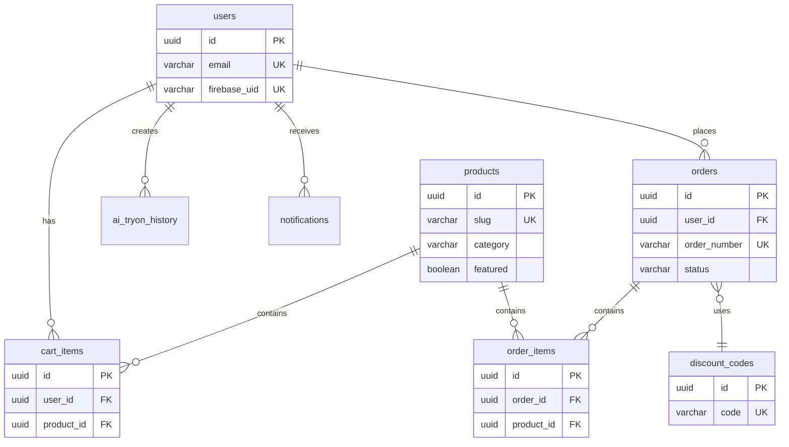

# Database Schema - Luxury Fashion Platform

**Database**: PostgreSQL 15+  
**ORM**: TypeORM (NestJS) / Prisma (alternative)

---

## Table of Contents

1. [Users](#users)
2. [Products](#products)
3. [Cart Items](#cart-items)
4. [Orders](#orders)
5. [Order Items](#order-items)
6. [Discount Codes](#discount-codes)
7. [Banners](#banners)
8. [AI Try-On History](#ai-try-on-history)
9. [Admin Users](#admin-users)
10. [Notifications](#notifications)
11. [Relationships](#relationships)
12. [Indexes](#indexes)
13. [Migration Scripts](#migration-scripts)

---

## Users

**Table**: `users`

| Column           | Type         | Constraints                             | Description                   |
| ---------------- | ------------ | --------------------------------------- | ----------------------------- |
| `id`             | UUID         | PRIMARY KEY, DEFAULT uuid_generate_v4() | Unique user identifier        |
| `email`          | VARCHAR(255) | UNIQUE, NOT NULL                        | User email address            |
| `full_name`      | VARCHAR(255) | NULL                                    | User's full name              |
| `phone`          | VARCHAR(20)  | NULL                                    | Phone number                  |
| `date_of_birth`  | DATE         | NULL                                    | Date of birth                 |
| `gender`         | VARCHAR(20)  | NULL                                    | Gender (male/female/other)    |
| `address`        | TEXT         | NULL                                    | Full address                  |
| `avatar_url`     | VARCHAR(500) | NULL                                    | Profile picture URL           |
| `firebase_uid`   | VARCHAR(255) | UNIQUE, NOT NULL                        | Firebase authentication UID   |
| `bank_account`   | JSONB        | NULL                                    | Bank account info (encrypted) |
| `wallet_info`    | JSONB        | NULL                                    | Digital wallet info           |
| `email_verified` | BOOLEAN      | DEFAULT FALSE                           | Email verification status     |
| `created_at`     | TIMESTAMP    | DEFAULT NOW()                           | Account creation timestamp    |
| `updated_at`     | TIMESTAMP    | DEFAULT NOW()                           | Last update timestamp         |

**JSONB Structure Examples:**

```json
// bank_account
{
  "bank_name": "Vietcombank",
  "account_number": "1234567890",
  "account_holder": "Nguyen Van A"
}

// wallet_info
{
  "momo": "0901234567",
  "zalopay": "0901234567"
}
```

**SQL:**

```sql
CREATE TABLE users (
  id UUID PRIMARY KEY DEFAULT uuid_generate_v4(),
  email VARCHAR(255) UNIQUE NOT NULL,
  full_name VARCHAR(255),
  phone VARCHAR(20),
  date_of_birth DATE,
  gender VARCHAR(20),
  address TEXT,
  avatar_url VARCHAR(500),
  firebase_uid VARCHAR(255) UNIQUE NOT NULL,
  bank_account JSONB,
  wallet_info JSONB,
  email_verified BOOLEAN DEFAULT FALSE,
  created_at TIMESTAMP DEFAULT NOW(),
  updated_at TIMESTAMP DEFAULT NOW()
);

CREATE INDEX idx_users_email ON users(email);
CREATE INDEX idx_users_firebase_uid ON users(firebase_uid);
```

---

## Products

**Table**: `products`

| Column              | Type          | Constraints                             | Description               |
| ------------------- | ------------- | --------------------------------------- | ------------------------- |
| `id`                | UUID          | PRIMARY KEY, DEFAULT uuid_generate_v4() | Unique product identifier |
| `name`              | VARCHAR(255)  | NOT NULL                                | Product name              |
| `slug`              | VARCHAR(255)  | UNIQUE, NOT NULL                        | URL-friendly name         |
| `description`       | TEXT          | NULL                                    | Product description       |
| `category`          | VARCHAR(50)   | NOT NULL                                | clothing / accessories    |
| `subcategory`       | VARCHAR(50)   | NULL                                    | shirts / pants / outfits  |
| `price`             | DECIMAL(10,2) | NOT NULL                                | Product price             |
| `compare_at_price`  | DECIMAL(10,2) | NULL                                    | Original price (for sale) |
| `images`            | JSONB         | NOT NULL                                | Array of image URLs       |
| `sizes`             | JSONB         | NOT NULL                                | Available sizes           |
| `stock`             | INTEGER       | DEFAULT 0                               | Total stock quantity      |
| `featured`          | BOOLEAN       | DEFAULT FALSE                           | Featured product flag     |
| `active`            | BOOLEAN       | DEFAULT TRUE                            | Product active status     |
| `sku`               | VARCHAR(100)  | UNIQUE                                  | Stock Keeping Unit        |
| `material`          | VARCHAR(255)  | NULL                                    | Product material          |
| `care_instructions` | TEXT          | NULL                                    | Care instructions         |
| `created_at`        | TIMESTAMP     | DEFAULT NOW()                           | Creation timestamp        |
| `updated_at`        | TIMESTAMP     | DEFAULT NOW()                           | Last update timestamp     |

**JSONB Structure Examples:**

```json
// images
[
  "https://storage.example.com/products/shirt-1-front.webp",
  "https://storage.example.com/products/shirt-1-back.webp",
  "https://storage.example.com/products/shirt-1-detail.webp"
]

// sizes
[
  { "size": "S", "stock": 10 },
  { "size": "M", "stock": 15 },
  { "size": "L", "stock": 8 },
  { "size": "XL", "stock": 5 }
]
```

**SQL:**

```sql
CREATE TABLE products (
  id UUID PRIMARY KEY DEFAULT uuid_generate_v4(),
  name VARCHAR(255) NOT NULL,
  slug VARCHAR(255) UNIQUE NOT NULL,
  description TEXT,
  category VARCHAR(50) NOT NULL,
  subcategory VARCHAR(50),
  price DECIMAL(10,2) NOT NULL,
  compare_at_price DECIMAL(10,2),
  images JSONB NOT NULL,
  sizes JSONB NOT NULL,
  stock INTEGER DEFAULT 0,
  featured BOOLEAN DEFAULT FALSE,
  active BOOLEAN DEFAULT TRUE,
  sku VARCHAR(100) UNIQUE,
  material VARCHAR(255),
  care_instructions TEXT,
  created_at TIMESTAMP DEFAULT NOW(),
  updated_at TIMESTAMP DEFAULT NOW()
);

CREATE INDEX idx_products_category ON products(category);
CREATE INDEX idx_products_featured ON products(featured) WHERE featured = TRUE;
CREATE INDEX idx_products_active ON products(active) WHERE active = TRUE;
CREATE INDEX idx_products_slug ON products(slug);
```

---

## Cart Items

**Table**: `cart_items`

| Column       | Type        | Constraints                             | Description                 |
| ------------ | ----------- | --------------------------------------- | --------------------------- |
| `id`         | UUID        | PRIMARY KEY, DEFAULT uuid_generate_v4() | Unique cart item identifier |
| `user_id`    | UUID        | FOREIGN KEY → users(id), NOT NULL       | User reference              |
| `product_id` | UUID        | FOREIGN KEY → products(id), NOT NULL    | Product reference           |
| `quantity`   | INTEGER     | NOT NULL, CHECK (quantity > 0)          | Item quantity               |
| `size`       | VARCHAR(10) | NOT NULL                                | Selected size               |
| `created_at` | TIMESTAMP   | DEFAULT NOW()                           | Added to cart timestamp     |
| `updated_at` | TIMESTAMP   | DEFAULT NOW()                           | Last update timestamp       |

**Constraints:**

- UNIQUE(user_id, product_id, size) - One entry per user/product/size combination

**SQL:**

```sql
CREATE TABLE cart_items (
  id UUID PRIMARY KEY DEFAULT uuid_generate_v4(),
  user_id UUID NOT NULL REFERENCES users(id) ON DELETE CASCADE,
  product_id UUID NOT NULL REFERENCES products(id) ON DELETE CASCADE,
  quantity INTEGER NOT NULL CHECK (quantity > 0),
  size VARCHAR(10) NOT NULL,
  created_at TIMESTAMP DEFAULT NOW(),
  updated_at TIMESTAMP DEFAULT NOW(),
  UNIQUE(user_id, product_id, size)
);

CREATE INDEX idx_cart_items_user ON cart_items(user_id);
CREATE INDEX idx_cart_items_product ON cart_items(product_id);
```

---

## Orders

**Table**: `orders`

| Column             | Type          | Constraints                             | Description                 |
| ------------------ | ------------- | --------------------------------------- | --------------------------- |
| `id`               | UUID          | PRIMARY KEY, DEFAULT uuid_generate_v4() | Unique order identifier     |
| `user_id`          | UUID          | FOREIGN KEY → users(id), NOT NULL       | User reference              |
| `order_number`     | VARCHAR(50)   | UNIQUE, NOT NULL                        | Human-readable order number |
| `total_amount`     | DECIMAL(10,2) | NOT NULL                                | Total order amount          |
| `discount_amount`  | DECIMAL(10,2) | DEFAULT 0                               | Discount applied            |
| `final_amount`     | DECIMAL(10,2) | NOT NULL                                | Final amount after discount |
| `status`           | VARCHAR(20)   | NOT NULL, DEFAULT 'pending'             | Order status                |
| `payment_method`   | VARCHAR(20)   | NOT NULL                                | cod / bank_transfer         |
| `payment_status`   | VARCHAR(20)   | DEFAULT 'unpaid'                        | Payment status              |
| `shipping_address` | JSONB         | NOT NULL                                | Shipping address details    |
| `customer_info`    | JSONB         | NOT NULL                                | Customer contact info       |
| `discount_code_id` | UUID          | FOREIGN KEY → discount_codes(id), NULL  | Applied discount code       |
| `notes`            | TEXT          | NULL                                    | Order notes                 |
| `platform`         | VARCHAR(10)   | DEFAULT 'web'                           | web / mobile                |
| `created_at`       | TIMESTAMP     | DEFAULT NOW()                           | Order creation timestamp    |
| `updated_at`       | TIMESTAMP     | DEFAULT NOW()                           | Last update timestamp       |

**Status Values:**

- `pending` - Order placed, awaiting confirmation
- `confirmed` - Order confirmed
- `processing` - Being prepared
- `shipped` - Shipped to customer
- `delivered` - Delivered successfully
- `cancelled` - Order cancelled

**JSONB Structure Examples:**

```json
// shipping_address
{
  "full_name": "Nguyen Van A",
  "phone": "0901234567",
  "address": "123 Nguyen Hue, District 1",
  "city": "Ho Chi Minh City",
  "district": "District 1",
  "ward": "Ben Nghe Ward",
  "postal_code": "700000"
}

// customer_info
{
  "full_name": "Nguyen Van A",
  "email": "customer@example.com",
  "phone": "0901234567"
}
```

**SQL:**

```sql
CREATE TABLE orders (
  id UUID PRIMARY KEY DEFAULT uuid_generate_v4(),
  user_id UUID NOT NULL REFERENCES users(id) ON DELETE RESTRICT,
  order_number VARCHAR(50) UNIQUE NOT NULL,
  total_amount DECIMAL(10,2) NOT NULL,
  discount_amount DECIMAL(10,2) DEFAULT 0,
  final_amount DECIMAL(10,2) NOT NULL,
  status VARCHAR(20) NOT NULL DEFAULT 'pending',
  payment_method VARCHAR(20) NOT NULL,
  payment_status VARCHAR(20) DEFAULT 'unpaid',
  shipping_address JSONB NOT NULL,
  customer_info JSONB NOT NULL,
  discount_code_id UUID REFERENCES discount_codes(id),
  notes TEXT,
  platform VARCHAR(10) DEFAULT 'web',
  created_at TIMESTAMP DEFAULT NOW(),
  updated_at TIMESTAMP DEFAULT NOW()
);

CREATE INDEX idx_orders_user ON orders(user_id);
CREATE INDEX idx_orders_status ON orders(status);
CREATE INDEX idx_orders_order_number ON orders(order_number);
CREATE INDEX idx_orders_created_at ON orders(created_at DESC);
```

---

## Order Items

**Table**: `order_items`

| Column             | Type          | Constraints                             | Description                   |
| ------------------ | ------------- | --------------------------------------- | ----------------------------- |
| `id`               | UUID          | PRIMARY KEY, DEFAULT uuid_generate_v4() | Unique order item identifier  |
| `order_id`         | UUID          | FOREIGN KEY → orders(id), NOT NULL      | Order reference               |
| `product_id`       | UUID          | FOREIGN KEY → products(id), NOT NULL    | Product reference             |
| `product_snapshot` | JSONB         | NOT NULL                                | Product data at purchase time |
| `quantity`         | INTEGER       | NOT NULL, CHECK (quantity > 0)          | Item quantity                 |
| `size`             | VARCHAR(10)   | NOT NULL                                | Selected size                 |
| `price`            | DECIMAL(10,2) | NOT NULL                                | Price at purchase time        |
| `subtotal`         | DECIMAL(10,2) | NOT NULL                                | quantity × price              |

**JSONB Structure Example:**

```json
// product_snapshot (preserve product data at purchase time)
{
  "name": "Elegant Silk Shirt",
  "sku": "SHIRT-001",
  "image": "https://storage.example.com/products/shirt-1.webp",
  "category": "clothing",
  "subcategory": "shirts"
}
```

**SQL:**

```sql
CREATE TABLE order_items (
  id UUID PRIMARY KEY DEFAULT uuid_generate_v4(),
  order_id UUID NOT NULL REFERENCES orders(id) ON DELETE CASCADE,
  product_id UUID NOT NULL REFERENCES products(id) ON DELETE RESTRICT,
  product_snapshot JSONB NOT NULL,
  quantity INTEGER NOT NULL CHECK (quantity > 0),
  size VARCHAR(10) NOT NULL,
  price DECIMAL(10,2) NOT NULL,
  subtotal DECIMAL(10,2) NOT NULL
);

CREATE INDEX idx_order_items_order ON order_items(order_id);
CREATE INDEX idx_order_items_product ON order_items(product_id);
```

---

## Discount Codes

**Table**: `discount_codes`

| Column              | Type          | Constraints                             | Description                           |
| ------------------- | ------------- | --------------------------------------- | ------------------------------------- |
| `id`                | UUID          | PRIMARY KEY, DEFAULT uuid_generate_v4() | Unique discount code identifier       |
| `code`              | VARCHAR(50)   | UNIQUE, NOT NULL                        | Discount code (uppercase)             |
| `description`       | TEXT          | NULL                                    | Code description                      |
| `discount_type`     | VARCHAR(20)   | NOT NULL                                | percentage / fixed                    |
| `discount_value`    | DECIMAL(10,2) | NOT NULL                                | Discount amount or percentage         |
| `min_purchase`      | DECIMAL(10,2) | DEFAULT 0                               | Minimum purchase amount               |
| `max_discount`      | DECIMAL(10,2) | NULL                                    | Max discount (for percentage)         |
| `max_uses`          | INTEGER       | NULL                                    | Maximum total uses (NULL = unlimited) |
| `max_uses_per_user` | INTEGER       | DEFAULT 1                               | Max uses per user                     |
| `used_count`        | INTEGER       | DEFAULT 0                               | Total times used                      |
| `valid_from`        | TIMESTAMP     | NOT NULL                                | Start date                            |
| `valid_until`       | TIMESTAMP     | NOT NULL                                | End date                              |
| `active`            | BOOLEAN       | DEFAULT TRUE                            | Active status                         |
| `created_at`        | TIMESTAMP     | DEFAULT NOW()                           | Creation timestamp                    |
| `updated_at`        | TIMESTAMP     | DEFAULT NOW()                           | Last update timestamp                 |

**SQL:**

```sql
CREATE TABLE discount_codes (
  id UUID PRIMARY KEY DEFAULT uuid_generate_v4(),
  code VARCHAR(50) UNIQUE NOT NULL,
  description TEXT,
  discount_type VARCHAR(20) NOT NULL,
  discount_value DECIMAL(10,2) NOT NULL,
  min_purchase DECIMAL(10,2) DEFAULT 0,
  max_discount DECIMAL(10,2),
  max_uses INTEGER,
  max_uses_per_user INTEGER DEFAULT 1,
  used_count INTEGER DEFAULT 0,
  valid_from TIMESTAMP NOT NULL,
  valid_until TIMESTAMP NOT NULL,
  active BOOLEAN DEFAULT TRUE,
  created_at TIMESTAMP DEFAULT NOW(),
  updated_at TIMESTAMP DEFAULT NOW()
);

CREATE INDEX idx_discount_codes_code ON discount_codes(code);
CREATE INDEX idx_discount_codes_active ON discount_codes(active) WHERE active = TRUE;
```

---

## Banners

**Table**: `banners`

| Column             | Type         | Constraints                             | Description                       |
| ------------------ | ------------ | --------------------------------------- | --------------------------------- |
| `id`               | UUID         | PRIMARY KEY, DEFAULT uuid_generate_v4() | Unique banner identifier          |
| `title`            | VARCHAR(255) | NOT NULL                                | Banner title                      |
| `subtitle`         | TEXT         | NULL                                    | Banner subtitle                   |
| `image_url`        | VARCHAR(500) | NOT NULL                                | Desktop image URL                 |
| `mobile_image_url` | VARCHAR(500) | NULL                                    | Mobile image URL (auto-generated) |
| `link`             | VARCHAR(500) | NULL                                    | Click-through URL                 |
| `position`         | INTEGER      | NOT NULL, DEFAULT 0                     | Display order                     |
| `active`           | BOOLEAN      | DEFAULT TRUE                            | Active status                     |
| `start_date`       | TIMESTAMP    | NULL                                    | Display start date                |
| `end_date`         | TIMESTAMP    | NULL                                    | Display end date                  |
| `created_at`       | TIMESTAMP    | DEFAULT NOW()                           | Creation timestamp                |
| `updated_at`       | TIMESTAMP    | DEFAULT NOW()                           | Last update timestamp             |

**SQL:**

```sql
CREATE TABLE banners (
  id UUID PRIMARY KEY DEFAULT uuid_generate_v4(),
  title VARCHAR(255) NOT NULL,
  subtitle TEXT,
  image_url VARCHAR(500) NOT NULL,
  mobile_image_url VARCHAR(500),
  link VARCHAR(500),
  position INTEGER NOT NULL DEFAULT 0,
  active BOOLEAN DEFAULT TRUE,
  start_date TIMESTAMP,
  end_date TIMESTAMP,
  created_at TIMESTAMP DEFAULT NOW(),
  updated_at TIMESTAMP DEFAULT NOW()
);

CREATE INDEX idx_banners_active ON banners(active) WHERE active = TRUE;
CREATE INDEX idx_banners_position ON banners(position);
```

---

## AI Try-On History

**Table**: `ai_tryon_history`

| Column             | Type         | Constraints                             | Description                     |
| ------------------ | ------------ | --------------------------------------- | ------------------------------- |
| `id`               | UUID         | PRIMARY KEY, DEFAULT uuid_generate_v4() | Unique try-on identifier        |
| `user_id`          | UUID         | FOREIGN KEY → users(id), NOT NULL       | User reference                  |
| `user_image_url`   | VARCHAR(500) | NOT NULL                                | User uploaded photo URL         |
| `product_images`   | JSONB        | NOT NULL                                | Array of product image URLs     |
| `result_image_url` | VARCHAR(500) | NOT NULL                                | Generated result URL            |
| `status`           | VARCHAR(20)  | DEFAULT 'completed'                     | processing / completed / failed |
| `processing_time`  | INTEGER      | NULL                                    | Processing time in seconds      |
| `created_at`       | TIMESTAMP    | DEFAULT NOW()                           | Creation timestamp              |

**JSONB Structure Example:**

```json
// product_images
[
  {
    "product_id": "uuid-here",
    "image_url": "https://storage.example.com/products/shirt-1.webp",
    "product_name": "Elegant Silk Shirt"
  }
]
```

**SQL:**

```sql
CREATE TABLE ai_tryon_history (
  id UUID PRIMARY KEY DEFAULT uuid_generate_v4(),
  user_id UUID NOT NULL REFERENCES users(id) ON DELETE CASCADE,
  user_image_url VARCHAR(500) NOT NULL,
  product_images JSONB NOT NULL,
  result_image_url VARCHAR(500) NOT NULL,
  status VARCHAR(20) DEFAULT 'completed',
  processing_time INTEGER,
  created_at TIMESTAMP DEFAULT NOW()
);

CREATE INDEX idx_ai_tryon_user ON ai_tryon_history(user_id);
CREATE INDEX idx_ai_tryon_created_at ON ai_tryon_history(created_at DESC);
```

---

## Admin Users

**Table**: `admin_users`

| Column          | Type         | Constraints                             | Description             |
| --------------- | ------------ | --------------------------------------- | ----------------------- |
| `id`            | UUID         | PRIMARY KEY, DEFAULT uuid_generate_v4() | Unique admin identifier |
| `email`         | VARCHAR(255) | UNIQUE, NOT NULL                        | Admin email             |
| `password_hash` | VARCHAR(255) | NOT NULL                                | Bcrypt password hash    |
| `full_name`     | VARCHAR(255) | NOT NULL                                | Admin full name         |
| `role`          | VARCHAR(20)  | NOT NULL, DEFAULT 'admin'               | super_admin / admin     |
| `active`        | BOOLEAN      | DEFAULT TRUE                            | Active status           |
| `last_login`    | TIMESTAMP    | NULL                                    | Last login timestamp    |
| `created_at`    | TIMESTAMP    | DEFAULT NOW()                           | Creation timestamp      |
| `updated_at`    | TIMESTAMP    | DEFAULT NOW()                           | Last update timestamp   |

**SQL:**

```sql
CREATE TABLE admin_users (
  id UUID PRIMARY KEY DEFAULT uuid_generate_v4(),
  email VARCHAR(255) UNIQUE NOT NULL,
  password_hash VARCHAR(255) NOT NULL,
  full_name VARCHAR(255) NOT NULL,
  role VARCHAR(20) NOT NULL DEFAULT 'admin',
  active BOOLEAN DEFAULT TRUE,
  last_login TIMESTAMP,
  created_at TIMESTAMP DEFAULT NOW(),
  updated_at TIMESTAMP DEFAULT NOW()
);

CREATE INDEX idx_admin_users_email ON admin_users(email);
```

---

## Notifications

**Table**: `notifications`

| Column       | Type         | Constraints                             | Description                    |
| ------------ | ------------ | --------------------------------------- | ------------------------------ |
| `id`         | UUID         | PRIMARY KEY, DEFAULT uuid_generate_v4() | Unique notification identifier |
| `user_id`    | UUID         | FOREIGN KEY → users(id), NOT NULL       | User reference                 |
| `type`       | VARCHAR(50)  | NOT NULL                                | Notification type              |
| `title`      | VARCHAR(255) | NOT NULL                                | Notification title             |
| `message`    | TEXT         | NOT NULL                                | Notification message           |
| `data`       | JSONB        | NULL                                    | Additional data                |
| `read`       | BOOLEAN      | DEFAULT FALSE                           | Read status                    |
| `created_at` | TIMESTAMP    | DEFAULT NOW()                           | Creation timestamp             |

**Notification Types:**

- `order_confirmed` - Order confirmed
- `order_shipped` - Order shipped
- `order_delivered` - Order delivered
- `promotion` - Promotional notification

**SQL:**

```sql
CREATE TABLE notifications (
  id UUID PRIMARY KEY DEFAULT uuid_generate_v4(),
  user_id UUID NOT NULL REFERENCES users(id) ON DELETE CASCADE,
  type VARCHAR(50) NOT NULL,
  title VARCHAR(255) NOT NULL,
  message TEXT NOT NULL,
  data JSONB,
  read BOOLEAN DEFAULT FALSE,
  created_at TIMESTAMP DEFAULT NOW()
);

CREATE INDEX idx_notifications_user ON notifications(user_id);
CREATE INDEX idx_notifications_read ON notifications(read) WHERE read = FALSE;
CREATE INDEX idx_notifications_created_at ON notifications(created_at DESC);
```

---

## Relationships



---

## Indexes Summary

**Performance Indexes:**

```sql
-- Users
CREATE INDEX idx_users_email ON users(email);
CREATE INDEX idx_users_firebase_uid ON users(firebase_uid);

-- Products
CREATE INDEX idx_products_category ON products(category);
CREATE INDEX idx_products_featured ON products(featured) WHERE featured = TRUE;
CREATE INDEX idx_products_active ON products(active) WHERE active = TRUE;
CREATE INDEX idx_products_slug ON products(slug);

-- Cart
CREATE INDEX idx_cart_items_user ON cart_items(user_id);
CREATE INDEX idx_cart_items_product ON cart_items(product_id);

-- Orders
CREATE INDEX idx_orders_user ON orders(user_id);
CREATE INDEX idx_orders_status ON orders(status);
CREATE INDEX idx_orders_order_number ON orders(order_number);
CREATE INDEX idx_orders_created_at ON orders(created_at DESC);

-- Order Items
CREATE INDEX idx_order_items_order ON order_items(order_id);
CREATE INDEX idx_order_items_product ON order_items(product_id);

-- Discount Codes
CREATE INDEX idx_discount_codes_code ON discount_codes(code);
CREATE INDEX idx_discount_codes_active ON discount_codes(active) WHERE active = TRUE;

-- Banners
CREATE INDEX idx_banners_active ON banners(active) WHERE active = TRUE;
CREATE INDEX idx_banners_position ON banners(position);

-- AI Try-On
CREATE INDEX idx_ai_tryon_user ON ai_tryon_history(user_id);
CREATE INDEX idx_ai_tryon_created_at ON ai_tryon_history(created_at DESC);

-- Notifications
CREATE INDEX idx_notifications_user ON notifications(user_id);
CREATE INDEX idx_notifications_read ON notifications(read) WHERE read = FALSE;
CREATE INDEX idx_notifications_created_at ON notifications(created_at DESC);

-- Admin
CREATE INDEX idx_admin_users_email ON admin_users(email);
```

---

## Migration Scripts

### Initial Migration

```sql
-- Enable UUID extension
CREATE EXTENSION IF NOT EXISTS "uuid-ossp";

-- Create all tables in order (respecting foreign key dependencies)
-- 1. Independent tables
CREATE TABLE users (...);
CREATE TABLE products (...);
CREATE TABLE admin_users (...);
CREATE TABLE discount_codes (...);
CREATE TABLE banners (...);

-- 2. Dependent tables
CREATE TABLE cart_items (...);
CREATE TABLE orders (...);
CREATE TABLE order_items (...);
CREATE TABLE ai_tryon_history (...);
CREATE TABLE notifications (...);

-- Create all indexes
-- (see Indexes Summary above)

-- Create updated_at trigger function
CREATE OR REPLACE FUNCTION update_updated_at_column()
RETURNS TRIGGER AS $$
BEGIN
    NEW.updated_at = NOW();
    RETURN NEW;
END;
$$ language 'plpgsql';

-- Apply trigger to tables with updated_at
CREATE TRIGGER update_users_updated_at BEFORE UPDATE ON users
    FOR EACH ROW EXECUTE FUNCTION update_updated_at_column();

CREATE TRIGGER update_products_updated_at BEFORE UPDATE ON products
    FOR EACH ROW EXECUTE FUNCTION update_updated_at_column();

CREATE TRIGGER update_cart_items_updated_at BEFORE UPDATE ON cart_items
    FOR EACH ROW EXECUTE FUNCTION update_updated_at_column();

CREATE TRIGGER update_orders_updated_at BEFORE UPDATE ON orders
    FOR EACH ROW EXECUTE FUNCTION update_updated_at_column();

CREATE TRIGGER update_discount_codes_updated_at BEFORE UPDATE ON discount_codes
    FOR EACH ROW EXECUTE FUNCTION update_updated_at_column();

CREATE TRIGGER update_banners_updated_at BEFORE UPDATE ON banners
    FOR EACH ROW EXECUTE FUNCTION update_updated_at_column();

CREATE TRIGGER update_admin_users_updated_at BEFORE UPDATE ON admin_users
    FOR EACH ROW EXECUTE FUNCTION update_updated_at_column();
```

### Sample Data

```sql
-- Insert sample admin user (password: admin123)
INSERT INTO admin_users (email, password_hash, full_name, role)
VALUES (
  'admin@luxuryfashion.com',
  '$2b$10$YourHashedPasswordHere',
  'System Administrator',
  'super_admin'
);

-- Insert sample products
INSERT INTO products (name, slug, description, category, subcategory, price, images, sizes, stock, featured, sku)
VALUES (
  'Elegant Silk Shirt',
  'elegant-silk-shirt',
  'Crafted with intention. Pure silk, timeless design.',
  'clothing',
  'shirts',
  1200000,
  '["https://example.com/shirt-1.webp", "https://example.com/shirt-2.webp"]'::jsonb,
  '[{"size":"S","stock":10},{"size":"M","stock":15},{"size":"L","stock":8}]'::jsonb,
  33,
  true,
  'SHIRT-001'
);

-- Insert sample discount code
INSERT INTO discount_codes (code, description, discount_type, discount_value, min_purchase, valid_from, valid_until)
VALUES (
  'WELCOME10',
  'Welcome discount for new customers',
  'percentage',
  10,
  500000,
  NOW(),
  NOW() + INTERVAL '30 days'
);
```

---

## Common Queries

### Get user cart with product details

```sql
SELECT
  ci.id,
  ci.quantity,
  ci.size,
  p.name,
  p.price,
  p.images->0 as image,
  (ci.quantity * p.price) as subtotal
FROM cart_items ci
JOIN products p ON ci.product_id = p.id
WHERE ci.user_id = $1;
```

### Get order with items

```sql
SELECT
  o.*,
  json_agg(
    json_build_object(
      'product_name', oi.product_snapshot->>'name',
      'quantity', oi.quantity,
      'size', oi.size,
      'price', oi.price,
      'subtotal', oi.subtotal
    )
  ) as items
FROM orders o
LEFT JOIN order_items oi ON o.id = oi.order_id
WHERE o.id = $1
GROUP BY o.id;
```

### Get featured products

```sql
SELECT * FROM products
WHERE featured = TRUE AND active = TRUE
ORDER BY created_at DESC
LIMIT 8;
```

### Validate discount code

```sql
SELECT * FROM discount_codes
WHERE code = $1
  AND active = TRUE
  AND valid_from <= NOW()
  AND valid_until >= NOW()
  AND (max_uses IS NULL OR used_count < max_uses);
```
