# UML Diagrams - Luxury Fashion Platform

Complete system modeling with Use Case, Class, Sequence, Activity, and Component diagrams.

---

## Table of Contents

1. [Use Case Diagrams](#use-case-diagrams)
2. [Class Diagrams](#class-diagrams)
3. [Sequence Diagrams](#sequence-diagrams)
4. [Activity Diagrams](#activity-diagrams)
5. [Component Diagrams](#component-diagrams)

---

## Use Case Diagrams

### 1. Customer Use Cases

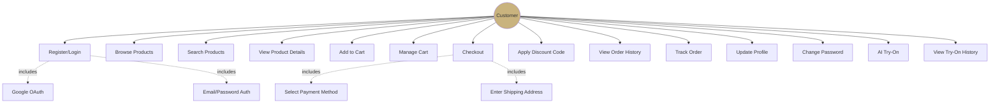
```mermaid
graph TB
    Customer((Customer))

    Customer --> UC1[Register/Login]
    Customer --> UC2[Browse Products]
    Customer --> UC3[Search Products]
    Customer --> UC4[View Product Details]
    Customer --> UC5[Add to Cart]
    Customer --> UC6[Manage Cart]
    Customer --> UC7[Checkout]
    Customer --> UC8[Apply Discount Code]
    Customer --> UC9[View Order History]
    Customer --> UC10[Track Order]
    Customer --> UC11[Update Profile]
    Customer --> UC12[Change Password]
    Customer --> UC13[AI Try-On]
    Customer --> UC14[View Try-On History]

    UC1 -.includes.-> UC15[Google OAuth]
    UC1 -.includes.-> UC16[Email/Password Auth]
    UC7 -.includes.-> UC17[Select Payment Method]
    UC7 -.includes.-> UC18[Enter Shipping Address]

    style Customer fill:#C9B37E
```

### 2. Admin Use Cases

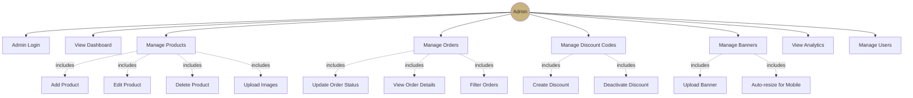
```mermaid
graph TB
    Admin((Admin))

    Admin --> UC20[Admin Login]
    Admin --> UC21[View Dashboard]
    Admin --> UC22[Manage Products]
    Admin --> UC23[Manage Orders]
    Admin --> UC24[Manage Discount Codes]
    Admin --> UC25[Manage Banners]
    Admin --> UC26[View Analytics]
    Admin --> UC27[Manage Users]

    UC22 -.includes.-> UC28[Add Product]
    UC22 -.includes.-> UC29[Edit Product]
    UC22 -.includes.-> UC30[Delete Product]
    UC22 -.includes.-> UC31[Upload Images]

    UC23 -.includes.-> UC32[Update Order Status]
    UC23 -.includes.-> UC33[View Order Details]
    UC23 -.includes.-> UC34[Filter Orders]

    UC24 -.includes.-> UC35[Create Discount]
    UC24 -.includes.-> UC36[Deactivate Discount]

    UC25 -.includes.-> UC37[Upload Banner]
    UC25 -.includes.-> UC38[Auto-resize for Mobile]

    style Admin fill:#C9B37E
```

### 3. AI Try-On Use Cases

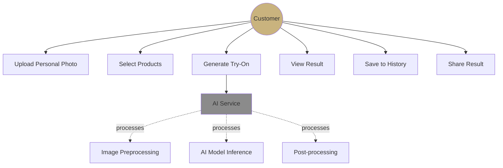
```mermaid
graph TB
    Customer((Customer))
    AIService[AI Service]

    Customer --> UC40[Upload Personal Photo]
    Customer --> UC41[Select Products]
    Customer --> UC42[Generate Try-On]
    Customer --> UC43[View Result]
    Customer --> UC44[Save to History]
    Customer --> UC45[Share Result]

    UC42 --> AIService
    AIService -.processes.-> UC46[Image Preprocessing]
    AIService -.processes.-> UC47[AI Model Inference]
    AIService -.processes.-> UC48[Post-processing]

    style Customer fill:#C9B37E
    style AIService fill:#8B8B8B
```

---

## Class Diagrams

### 1. Core Domain Classes

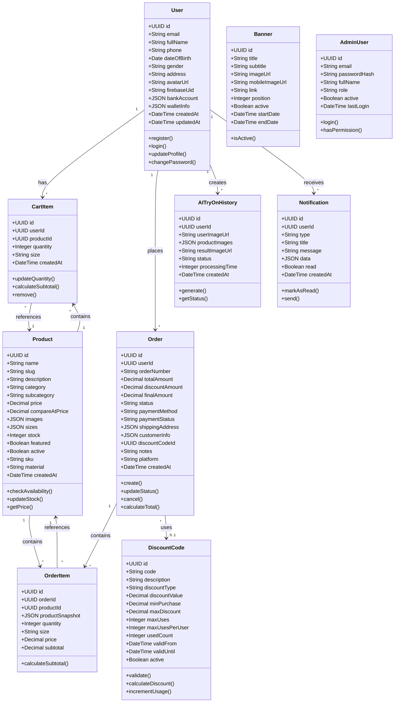
```mermaid
classDiagram
    class User {
        +UUID id
        +String email
        +String fullName
        +String phone
        +Date dateOfBirth
        +String gender
        +String address
        +String avatarUrl
        +String firebaseUid
        +JSON bankAccount
        +JSON walletInfo
        +DateTime createdAt
        +DateTime updatedAt
        +register()
        +login()
        +updateProfile()
        +changePassword()
    }

    class Product {
        +UUID id
        +String name
        +String slug
        +String description
        +String category
        +String subcategory
        +Decimal price
        +Decimal compareAtPrice
        +JSON images
        +JSON sizes
        +Integer stock
        +Boolean featured
        +Boolean active
        +String sku
        +String material
        +DateTime createdAt
        +checkAvailability()
        +updateStock()
        +getPrice()
    }

    class CartItem {
        +UUID id
        +UUID userId
        +UUID productId
        +Integer quantity
        +String size
        +DateTime createdAt
        +updateQuantity()
        +calculateSubtotal()
        +remove()
    }

    class Order {
        +UUID id
        +UUID userId
        +String orderNumber
        +Decimal totalAmount
        +Decimal discountAmount
        +Decimal finalAmount
        +String status
        +String paymentMethod
        +String paymentStatus
        +JSON shippingAddress
        +JSON customerInfo
        +UUID discountCodeId
        +String notes
        +String platform
        +DateTime createdAt
        +create()
        +updateStatus()
        +cancel()
        +calculateTotal()
    }

    class OrderItem {
        +UUID id
        +UUID orderId
        +UUID productId
        +JSON productSnapshot
        +Integer quantity
        +String size
        +Decimal price
        +Decimal subtotal
        +calculateSubtotal()
    }

    class DiscountCode {
        +UUID id
        +String code
        +String description
        +String discountType
        +Decimal discountValue
        +Decimal minPurchase
        +Decimal maxDiscount
        +Integer maxUses
        +Integer maxUsesPerUser
        +Integer usedCount
        +DateTime validFrom
        +DateTime validUntil
        +Boolean active
        +validate()
        +calculateDiscount()
        +incrementUsage()
    }

    class Banner {
        +UUID id
        +String title
        +String subtitle
        +String imageUrl
        +String mobileImageUrl
        +String link
        +Integer position
        +Boolean active
        +DateTime startDate
        +DateTime endDate
        +isActive()
    }

    class AITryOnHistory {
        +UUID id
        +UUID userId
        +String userImageUrl
        +JSON productImages
        +String resultImageUrl
        +String status
        +Integer processingTime
        +DateTime createdAt
        +generate()
        +getStatus()
    }

    class AdminUser {
        +UUID id
        +String email
        +String passwordHash
        +String fullName
        +String role
        +Boolean active
        +DateTime lastLogin
        +login()
        +hasPermission()
    }

    class Notification {
        +UUID id
        +UUID userId
        +String type
        +String title
        +String message
        +JSON data
        +Boolean read
        +DateTime createdAt
        +markAsRead()
        +send()
    }

    User "1" --> "*" CartItem : has
    User "1" --> "*" Order : places
    User "1" --> "*" AITryOnHistory : creates
    User "1" --> "*" Notification : receives

    Product "1" --> "*" CartItem : contains
    Product "1" --> "*" OrderItem : contains

    Order "1" --> "*" OrderItem : contains
    Order "*" --> "0..1" DiscountCode : uses

    CartItem "*" --> "1" Product : references
    OrderItem "*" --> "1" Product : references
```

### 2. Service Layer Classes

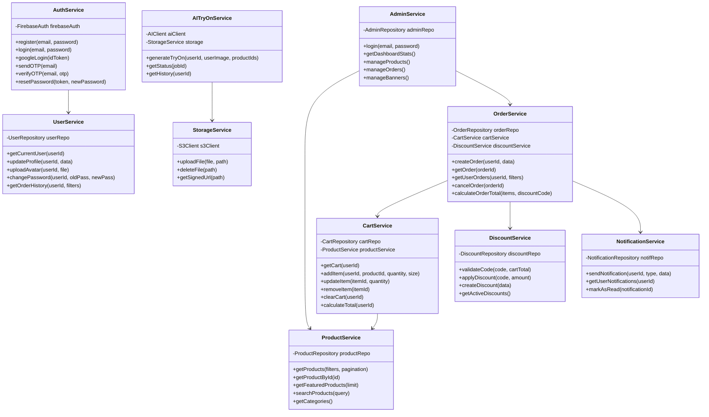
```mermaid
classDiagram
    class AuthService {
        -FirebaseAuth firebaseAuth
        +register(email, password)
        +login(email, password)
        +googleLogin(idToken)
        +sendOTP(email)
        +verifyOTP(email, otp)
        +resetPassword(token, newPassword)
    }

    class UserService {
        -UserRepository userRepo
        +getCurrentUser(userId)
        +updateProfile(userId, data)
        +uploadAvatar(userId, file)
        +changePassword(userId, oldPass, newPass)
        +getOrderHistory(userId, filters)
    }

    class ProductService {
        -ProductRepository productRepo
        +getProducts(filters, pagination)
        +getProductById(id)
        +getFeaturedProducts(limit)
        +searchProducts(query)
        +getCategories()
    }

    class CartService {
        -CartRepository cartRepo
        -ProductService productService
        +getCart(userId)
        +addItem(userId, productId, quantity, size)
        +updateItem(itemId, quantity)
        +removeItem(itemId)
        +clearCart(userId)
        +calculateTotal(userId)
    }

    class OrderService {
        -OrderRepository orderRepo
        -CartService cartService
        -DiscountService discountService
        +createOrder(userId, data)
        +getOrder(orderId)
        +getUserOrders(userId, filters)
        +cancelOrder(orderId)
        +calculateOrderTotal(items, discountCode)
    }

    class DiscountService {
        -DiscountRepository discountRepo
        +validateCode(code, cartTotal)
        +applyDiscount(code, amount)
        +createDiscount(data)
        +getActiveDiscounts()
    }

    class AITryOnService {
        -AIClient aiClient
        -StorageService storage
        +generateTryOn(userId, userImage, productIds)
        +getStatus(jobId)
        +getHistory(userId)
    }

    class AdminService {
        -AdminRepository adminRepo
        +login(email, password)
        +getDashboardStats()
        +manageProducts()
        +manageOrders()
        +manageBanners()
    }

    class StorageService {
        -S3Client s3Client
        +uploadFile(file, path)
        +deleteFile(path)
        +getSignedUrl(path)
    }

    class NotificationService {
        -NotificationRepository notifRepo
        +sendNotification(userId, type, data)
        +getUserNotifications(userId)
        +markAsRead(notificationId)
    }

    AuthService --> UserService
    CartService --> ProductService
    OrderService --> CartService
    OrderService --> DiscountService
    OrderService --> NotificationService
    AITryOnService --> StorageService
    AdminService --> ProductService
    AdminService --> OrderService
```

---

## Sequence Diagrams

### 1. User Registration & Login Flow

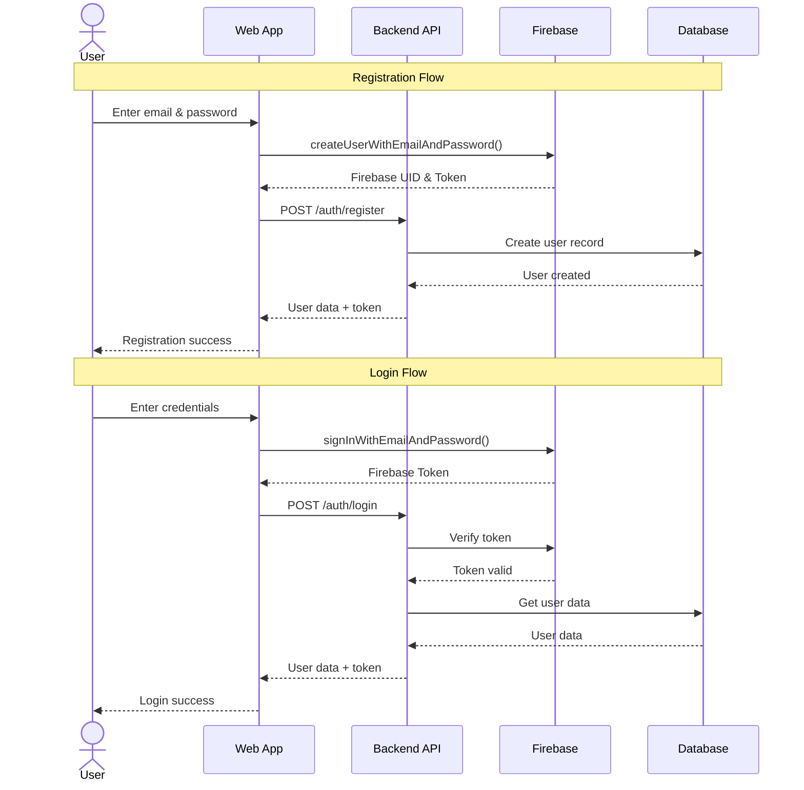
```mermaid
sequenceDiagram
    actor User
    participant Web as Web App
    participant API as Backend API
    participant Firebase
    participant DB as Database

    Note over User,DB: Registration Flow
    User->>Web: Enter email & password
    Web->>Firebase: createUserWithEmailAndPassword()
    Firebase-->>Web: Firebase UID & Token
    Web->>API: POST /auth/register
    API->>DB: Create user record
    DB-->>API: User created
    API-->>Web: User data + token
    Web-->>User: Registration success

    Note over User,DB: Login Flow
    User->>Web: Enter credentials
    Web->>Firebase: signInWithEmailAndPassword()
    Firebase-->>Web: Firebase Token
    Web->>API: POST /auth/login
    API->>Firebase: Verify token
    Firebase-->>API: Token valid
    API->>DB: Get user data
    DB-->>API: User data
    API-->>Web: User data + token
    Web-->>User: Login success
```

### 2. Shopping & Add to Cart Flow

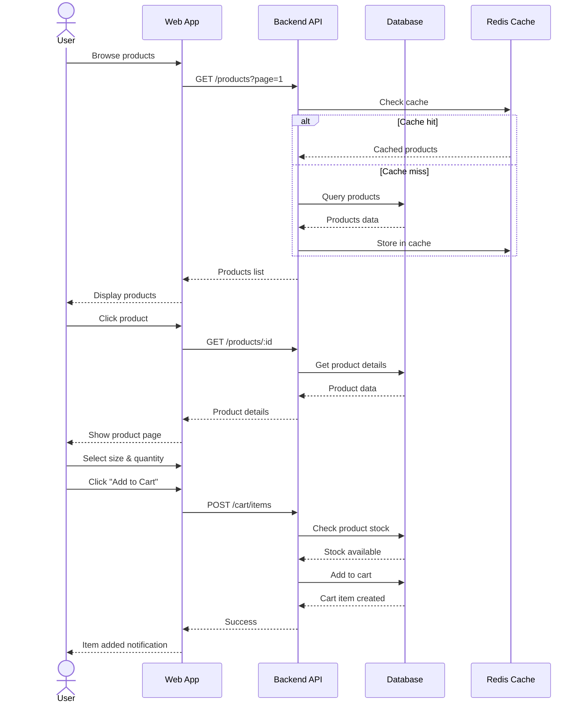
```mermaid
sequenceDiagram
    actor User
    participant Web as Web App
    participant API as Backend API
    participant DB as Database
    participant Cache as Redis Cache

    User->>Web: Browse products
    Web->>API: GET /products?page=1
    API->>Cache: Check cache
    alt Cache hit
        Cache-->>API: Cached products
    else Cache miss
        API->>DB: Query products
        DB-->>API: Products data
        API->>Cache: Store in cache
    end
    API-->>Web: Products list
    Web-->>User: Display products

    User->>Web: Click product
    Web->>API: GET /products/:id
    API->>DB: Get product details
    DB-->>API: Product data
    API-->>Web: Product details
    Web-->>User: Show product page

    User->>Web: Select size & quantity
    User->>Web: Click "Add to Cart"
    Web->>API: POST /cart/items
    API->>DB: Check product stock
    DB-->>API: Stock available
    API->>DB: Add to cart
    DB-->>API: Cart item created
    API-->>Web: Success
    Web-->>User: Item added notification
```

### 3. Checkout & Order Creation Flow

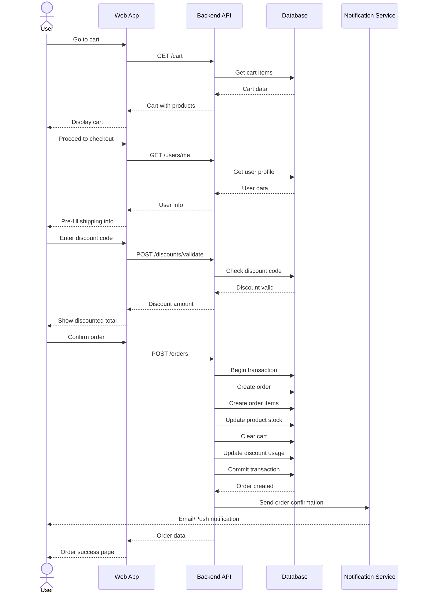
```mermaid
sequenceDiagram
    actor User
    participant Web as Web App
    participant API as Backend API
    participant DB as Database
    participant Notification as Notification Service

    User->>Web: Go to cart
    Web->>API: GET /cart
    API->>DB: Get cart items
    DB-->>API: Cart data
    API-->>Web: Cart with products
    Web-->>User: Display cart

    User->>Web: Proceed to checkout
    Web->>API: GET /users/me
    API->>DB: Get user profile
    DB-->>API: User data
    API-->>Web: User info
    Web-->>User: Pre-fill shipping info

    User->>Web: Enter discount code
    Web->>API: POST /discounts/validate
    API->>DB: Check discount code
    DB-->>API: Discount valid
    API-->>Web: Discount amount
    Web-->>User: Show discounted total

    User->>Web: Confirm order
    Web->>API: POST /orders
    API->>DB: Begin transaction
    API->>DB: Create order
    API->>DB: Create order items
    API->>DB: Update product stock
    API->>DB: Clear cart
    API->>DB: Update discount usage
    API->>DB: Commit transaction
    DB-->>API: Order created

    API->>Notification: Send order confirmation
    Notification-->>User: Email/Push notification

    API-->>Web: Order data
    Web-->>User: Order success page
```

### 4. AI Try-On Flow

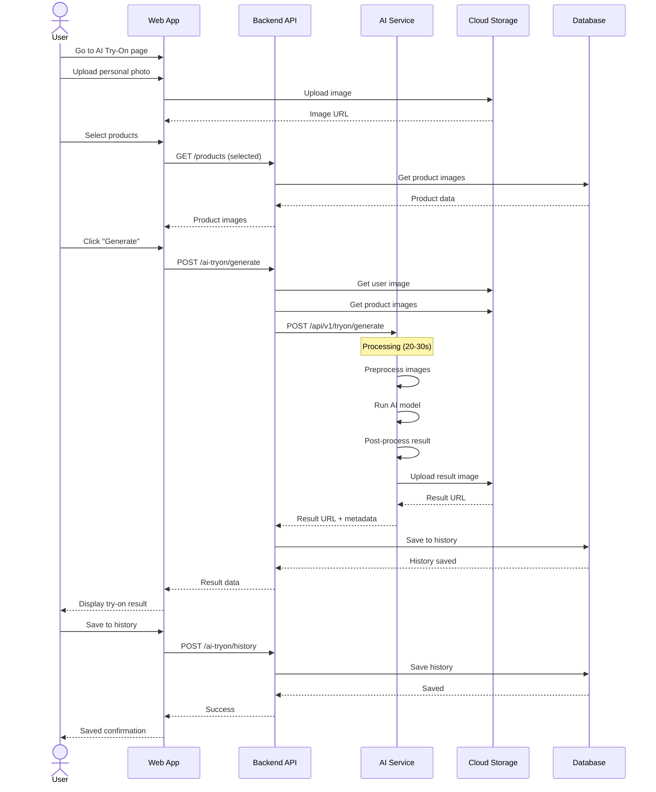
```mermaid
sequenceDiagram
    actor User
    participant Web as Web App
    participant API as Backend API
    participant AIService as AI Service
    participant Storage as Cloud Storage
    participant DB as Database

    User->>Web: Go to AI Try-On page
    User->>Web: Upload personal photo
    Web->>Storage: Upload image
    Storage-->>Web: Image URL

    User->>Web: Select products
    Web->>API: GET /products (selected)
    API->>DB: Get product images
    DB-->>API: Product data
    API-->>Web: Product images

    User->>Web: Click "Generate"
    Web->>API: POST /ai-tryon/generate
    API->>Storage: Get user image
    API->>Storage: Get product images
    API->>AIService: POST /api/v1/tryon/generate

    Note over AIService: Processing (20-30s)
    AIService->>AIService: Preprocess images
    AIService->>AIService: Run AI model
    AIService->>AIService: Post-process result
    AIService->>Storage: Upload result image
    Storage-->>AIService: Result URL

    AIService-->>API: Result URL + metadata
    API->>DB: Save to history
    DB-->>API: History saved
    API-->>Web: Result data
    Web-->>User: Display try-on result

    User->>Web: Save to history
    Web->>API: POST /ai-tryon/history
    API->>DB: Save history
    DB-->>API: Saved
    API-->>Web: Success
    Web-->>User: Saved confirmation
```

### 5. Admin Product Management Flow

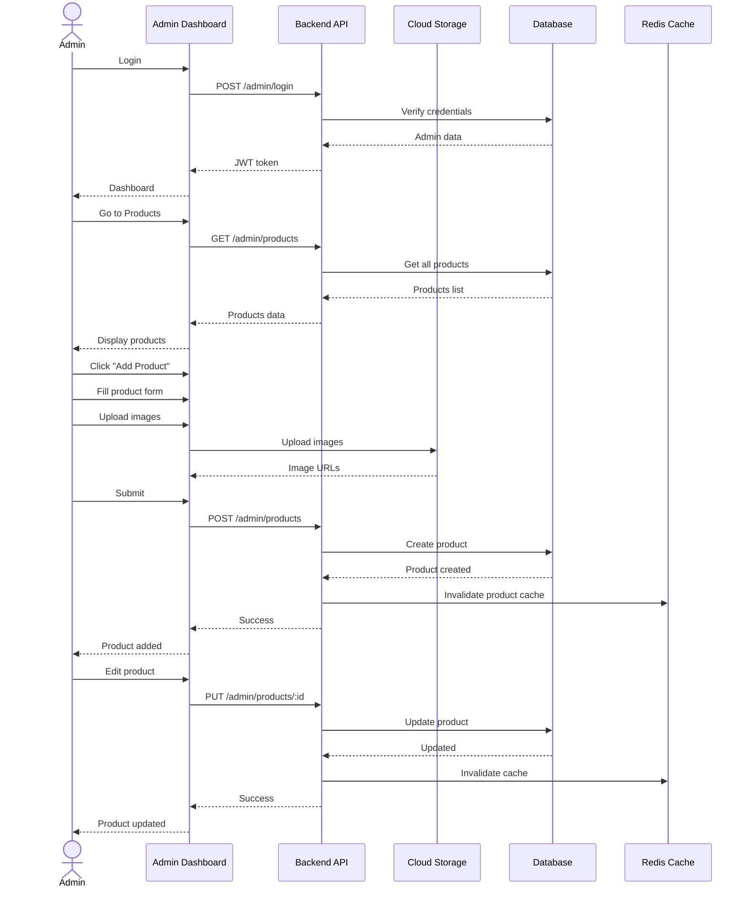
```mermaid
sequenceDiagram
    actor Admin
    participant AdminWeb as Admin Dashboard
    participant API as Backend API
    participant Storage as Cloud Storage
    participant DB as Database
    participant Cache as Redis Cache

    Admin->>AdminWeb: Login
    AdminWeb->>API: POST /admin/login
    API->>DB: Verify credentials
    DB-->>API: Admin data
    API-->>AdminWeb: JWT token
    AdminWeb-->>Admin: Dashboard

    Admin->>AdminWeb: Go to Products
    AdminWeb->>API: GET /admin/products
    API->>DB: Get all products
    DB-->>API: Products list
    API-->>AdminWeb: Products data
    AdminWeb-->>Admin: Display products

    Admin->>AdminWeb: Click "Add Product"
    Admin->>AdminWeb: Fill product form
    Admin->>AdminWeb: Upload images
    AdminWeb->>Storage: Upload images
    Storage-->>AdminWeb: Image URLs

    Admin->>AdminWeb: Submit
    AdminWeb->>API: POST /admin/products
    API->>DB: Create product
    DB-->>API: Product created
    API->>Cache: Invalidate product cache
    API-->>AdminWeb: Success
    AdminWeb-->>Admin: Product added

    Admin->>AdminWeb: Edit product
    AdminWeb->>API: PUT /admin/products/:id
    API->>DB: Update product
    DB-->>API: Updated
    API->>Cache: Invalidate cache
    API-->>AdminWeb: Success
    AdminWeb-->>Admin: Product updated
```

---

## Activity Diagrams

### 1. Customer Shopping Flow

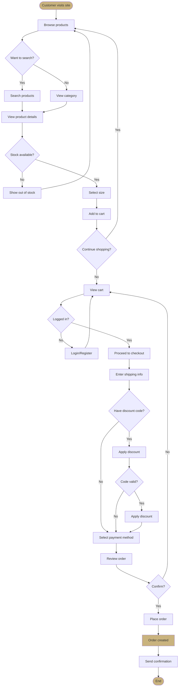
```mermaid
flowchart TD
    Start([Customer visits site]) --> Browse[Browse products]
    Browse --> Search{Want to search?}
    Search -->|Yes| SearchProducts[Search products]
    Search -->|No| ViewCategory[View category]

    SearchProducts --> ViewProduct[View product details]
    ViewCategory --> ViewProduct

    ViewProduct --> CheckStock{Stock available?}
    CheckStock -->|No| OutOfStock[Show out of stock]
    OutOfStock --> Browse
    CheckStock -->|Yes| SelectSize[Select size]

    SelectSize --> AddCart[Add to cart]
    AddCart --> ContinueShopping{Continue shopping?}
    ContinueShopping -->|Yes| Browse
    ContinueShopping -->|No| ViewCart[View cart]

    ViewCart --> CheckLogin{Logged in?}
    CheckLogin -->|No| Login[Login/Register]
    Login --> ViewCart
    CheckLogin -->|Yes| Checkout[Proceed to checkout]

    Checkout --> EnterShipping[Enter shipping info]
    EnterShipping --> HasDiscount{Have discount code?}
    HasDiscount -->|Yes| ApplyDiscount[Apply discount]
    HasDiscount -->|No| SelectPayment[Select payment method]
    ApplyDiscount --> ValidateDiscount{Code valid?}
    ValidateDiscount -->|No| SelectPayment
    ValidateDiscount -->|Yes| ApplyDiscountSuccess[Apply discount]
    ApplyDiscountSuccess --> SelectPayment

    SelectPayment --> ReviewOrder[Review order]
    ReviewOrder --> ConfirmOrder{Confirm?}
    ConfirmOrder -->|No| ViewCart
    ConfirmOrder -->|Yes| PlaceOrder[Place order]

    PlaceOrder --> OrderSuccess[Order created]
    OrderSuccess --> SendNotification[Send confirmation]
    SendNotification --> End([End])

    style Start fill:#C9B37E
    style End fill:#C9B37E
    style OrderSuccess fill:#C9B37E
```

### 2. AI Try-On Process Flow

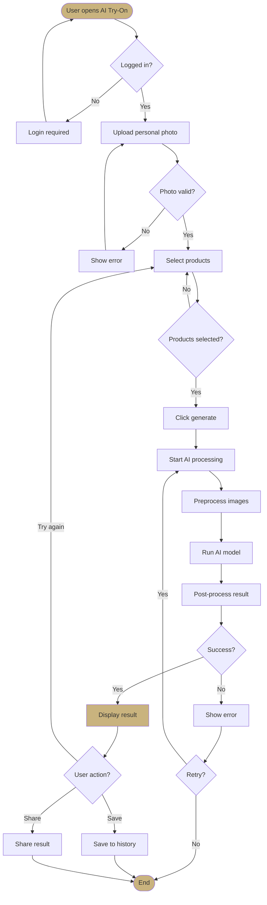
```mermaid
flowchart TD
    Start([User opens AI Try-On]) --> CheckLogin{Logged in?}
    CheckLogin -->|No| Login[Login required]
    Login --> Start
    CheckLogin -->|Yes| UploadPhoto[Upload personal photo]

    UploadPhoto --> ValidatePhoto{Photo valid?}
    ValidatePhoto -->|No| PhotoError[Show error]
    PhotoError --> UploadPhoto
    ValidatePhoto -->|Yes| SelectProducts[Select products]

    SelectProducts --> HasProducts{Products selected?}
    HasProducts -->|No| SelectProducts
    HasProducts -->|Yes| ClickGenerate[Click generate]

    ClickGenerate --> StartProcessing[Start AI processing]
    StartProcessing --> Preprocess[Preprocess images]
    Preprocess --> RunModel[Run AI model]
    RunModel --> Postprocess[Post-process result]

    Postprocess --> CheckResult{Success?}
    CheckResult -->|No| ProcessError[Show error]
    ProcessError --> Retry{Retry?}
    Retry -->|Yes| StartProcessing
    Retry -->|No| End([End])

    CheckResult -->|Yes| DisplayResult[Display result]
    DisplayResult --> UserAction{User action?}
    UserAction -->|Save| SaveHistory[Save to history]
    UserAction -->|Share| ShareResult[Share result]
    UserAction -->|Try again| SelectProducts

    SaveHistory --> End
    ShareResult --> End

    style Start fill:#C9B37E
    style End fill:#C9B37E
    style DisplayResult fill:#C9B37E
```

### 3. Order Processing Flow (Admin)

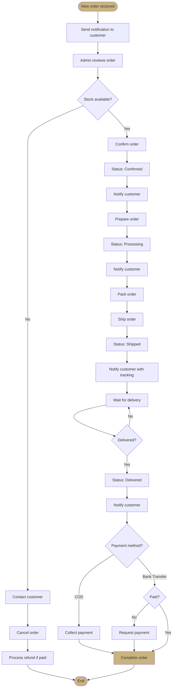
```mermaid
flowchart TD
    Start([New order received]) --> SendNotification[Send notification to customer]
    SendNotification --> AdminReview[Admin reviews order]

    AdminReview --> CheckStock{Stock available?}
    CheckStock -->|No| ContactCustomer[Contact customer]
    ContactCustomer --> CancelOrder[Cancel order]
    CancelOrder --> RefundProcess[Process refund if paid]
    RefundProcess --> End([End])

    CheckStock -->|Yes| ConfirmOrder[Confirm order]
    ConfirmOrder --> UpdateStatus1[Status: Confirmed]
    UpdateStatus1 --> NotifyCustomer1[Notify customer]

    NotifyCustomer1 --> PrepareOrder[Prepare order]
    PrepareOrder --> UpdateStatus2[Status: Processing]
    UpdateStatus2 --> NotifyCustomer2[Notify customer]

    NotifyCustomer2 --> PackOrder[Pack order]
    PackOrder --> ShipOrder[Ship order]
    ShipOrder --> UpdateStatus3[Status: Shipped]
    UpdateStatus3 --> NotifyCustomer3[Notify customer with tracking]

    NotifyCustomer3 --> WaitDelivery[Wait for delivery]
    WaitDelivery --> CheckDelivery{Delivered?}
    CheckDelivery -->|No| WaitDelivery
    CheckDelivery -->|Yes| UpdateStatus4[Status: Delivered]

    UpdateStatus4 --> NotifyCustomer4[Notify customer]
    NotifyCustomer4 --> CheckPayment{Payment method?}
    CheckPayment -->|COD| CollectPayment[Collect payment]
    CheckPayment -->|Bank Transfer| CheckPaid{Paid?}
    CheckPaid -->|No| RequestPayment[Request payment]
    CheckPaid -->|Yes| CompleteOrder[Complete order]
    CollectPayment --> CompleteOrder
    RequestPayment --> CompleteOrder

    CompleteOrder --> End

    style Start fill:#C9B37E
    style End fill:#C9B37E
    style CompleteOrder fill:#C9B37E
```

### 4. Discount Code Validation Flow

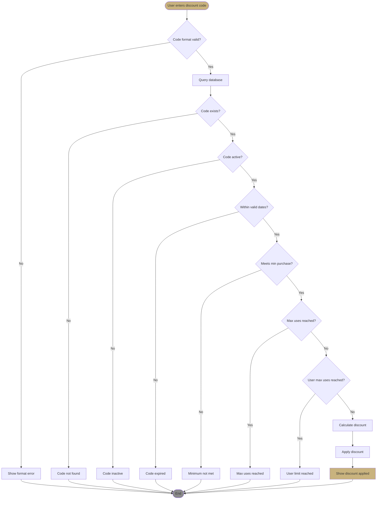
```mermaid
flowchart TD
    Start([User enters discount code]) --> CheckFormat{Code format valid?}
    CheckFormat -->|No| FormatError[Show format error]
    FormatError --> End([End])

    CheckFormat -->|Yes| QueryDB[Query database]
    QueryDB --> CodeExists{Code exists?}
    CodeExists -->|No| NotFound[Code not found]
    NotFound --> End

    CodeExists -->|Yes| CheckActive{Code active?}
    CheckActive -->|No| Inactive[Code inactive]
    Inactive --> End

    CheckActive -->|Yes| CheckDates{Within valid dates?}
    CheckDates -->|No| Expired[Code expired]
    Expired --> End

    CheckDates -->|Yes| CheckMinPurchase{Meets min purchase?}
    CheckMinPurchase -->|No| MinNotMet[Minimum not met]
    MinNotMet --> End

    CheckMinPurchase -->|Yes| CheckMaxUses{Max uses reached?}
    CheckMaxUses -->|Yes| MaxReached[Max uses reached]
    MaxReached --> End

    CheckMaxUses -->|No| CheckUserUses{User max uses reached?}
    CheckUserUses -->|Yes| UserMaxReached[User limit reached]
    UserMaxReached --> End

    CheckUserUses -->|No| CalculateDiscount[Calculate discount]
    CalculateDiscount --> ApplyDiscount[Apply discount]
    ApplyDiscount --> Success[Show discount applied]
    Success --> End

    style Start fill:#C9B37E
    style Success fill:#C9B37E
    style End fill:#8B8B8B
```

---

## Component Diagrams

### 1. System Architecture Overview

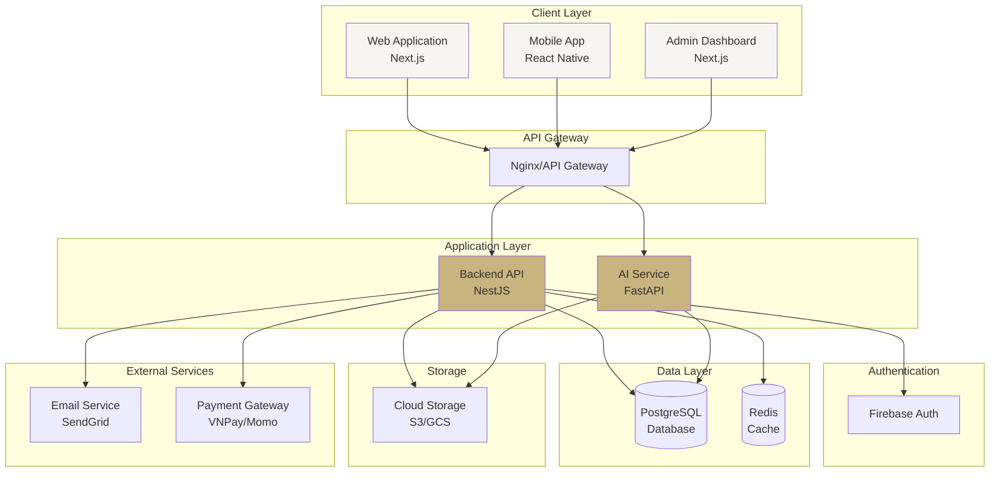
```mermaid
graph TB
    subgraph "Client Layer"
        WebApp[Web Application<br/>Next.js]
        MobileApp[Mobile App<br/>React Native]
        AdminWeb[Admin Dashboard<br/>Next.js]
    end

    subgraph "API Gateway"
        Gateway[Nginx/API Gateway]
    end

    subgraph "Application Layer"
        Backend[Backend API<br/>NestJS]
        AIService[AI Service<br/>FastAPI]
    end

    subgraph "Authentication"
        Firebase[Firebase Auth]
    end

    subgraph "Data Layer"
        PostgreSQL[(PostgreSQL<br/>Database)]
        Redis[(Redis<br/>Cache)]
    end

    subgraph "Storage"
        S3[Cloud Storage<br/>S3/GCS]
    end

    subgraph "External Services"
        Email[Email Service<br/>SendGrid]
        Payment[Payment Gateway<br/>VNPay/Momo]
    end

    WebApp --> Gateway
    MobileApp --> Gateway
    AdminWeb --> Gateway

    Gateway --> Backend
    Gateway --> AIService

    Backend --> Firebase
    Backend --> PostgreSQL
    Backend --> Redis
    Backend --> S3
    Backend --> Email
    Backend --> Payment

    AIService --> S3
    AIService --> PostgreSQL

    style WebApp fill:#F7F5F2
    style MobileApp fill:#F7F5F2
    style AdminWeb fill:#F7F5F2
    style Backend fill:#C9B37E
    style AIService fill:#C9B37E
```

### 2. Backend Service Components

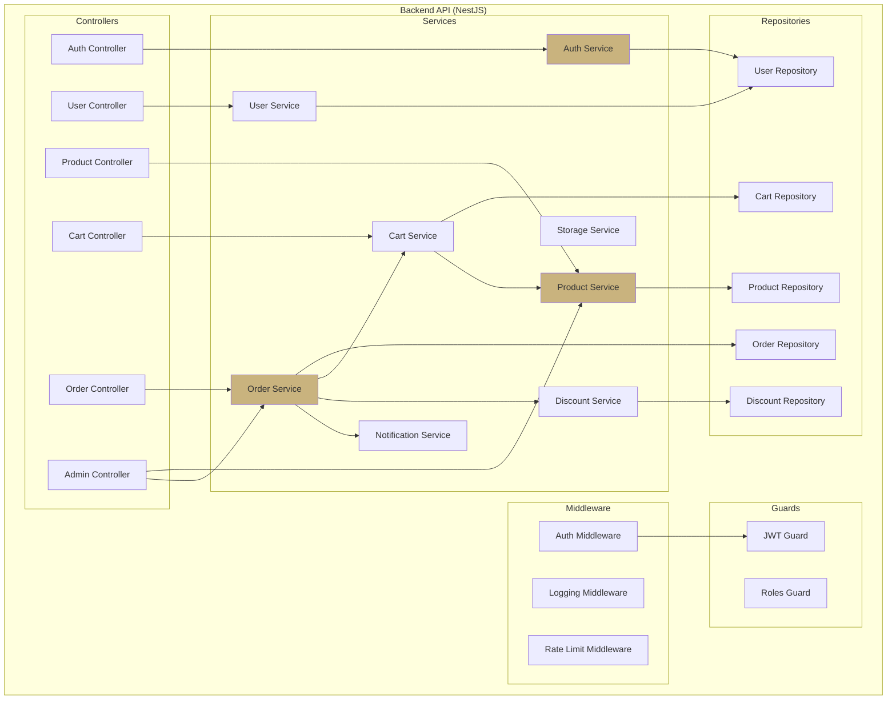
```mermaid
graph TB
    subgraph "Backend API (NestJS)"
        subgraph "Controllers"
            AuthController[Auth Controller]
            UserController[User Controller]
            ProductController[Product Controller]
            CartController[Cart Controller]
            OrderController[Order Controller]
            AdminController[Admin Controller]
        end

        subgraph "Services"
            AuthService[Auth Service]
            UserService[User Service]
            ProductService[Product Service]
            CartService[Cart Service]
            OrderService[Order Service]
            DiscountService[Discount Service]
            NotificationService[Notification Service]
            StorageService[Storage Service]
        end

        subgraph "Repositories"
            UserRepo[User Repository]
            ProductRepo[Product Repository]
            CartRepo[Cart Repository]
            OrderRepo[Order Repository]
            DiscountRepo[Discount Repository]
        end

        subgraph "Middleware"
            AuthMiddleware[Auth Middleware]
            LoggingMiddleware[Logging Middleware]
            RateLimitMiddleware[Rate Limit Middleware]
        end

        subgraph "Guards"
            JwtGuard[JWT Guard]
            RolesGuard[Roles Guard]
        end
    end

    AuthController --> AuthService
    UserController --> UserService
    ProductController --> ProductService
    CartController --> CartService
    OrderController --> OrderService
    AdminController --> ProductService
    AdminController --> OrderService

    AuthService --> UserRepo
    UserService --> UserRepo
    ProductService --> ProductRepo
    CartService --> CartRepo
    CartService --> ProductService
    OrderService --> OrderRepo
    OrderService --> CartService
    OrderService --> DiscountService
    OrderService --> NotificationService

    DiscountService --> DiscountRepo

    AuthMiddleware --> JwtGuard

    style AuthService fill:#C9B37E
    style ProductService fill:#C9B37E
    style OrderService fill:#C9B37E
```

### 3. Frontend Web Components

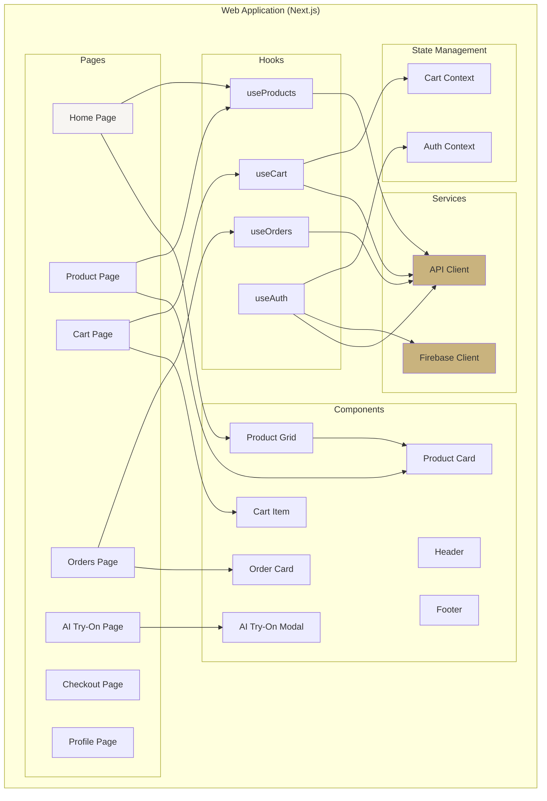
```mermaid
graph TB
    subgraph "Web Application (Next.js)"
        subgraph "Pages"
            HomePage[Home Page]
            ProductPage[Product Page]
            CartPage[Cart Page]
            CheckoutPage[Checkout Page]
            ProfilePage[Profile Page]
            OrdersPage[Orders Page]
            AITryOnPage[AI Try-On Page]
        end

        subgraph "Components"
            Header[Header]
            Footer[Footer]
            ProductCard[Product Card]
            ProductGrid[Product Grid]
            CartItem[Cart Item]
            OrderCard[Order Card]
            AITryOnModal[AI Try-On Modal]
        end

        subgraph "Hooks"
            useAuth[useAuth]
            useCart[useCart]
            useProducts[useProducts]
            useOrders[useOrders]
        end

        subgraph "Services"
            APIClient[API Client]
            FirebaseClient[Firebase Client]
        end

        subgraph "State Management"
            AuthContext[Auth Context]
            CartContext[Cart Context]
        end
    end

    HomePage --> ProductGrid
    ProductPage --> ProductCard
    CartPage --> CartItem
    OrdersPage --> OrderCard
    AITryOnPage --> AITryOnModal

    ProductGrid --> ProductCard

    HomePage --> useProducts
    ProductPage --> useProducts
    CartPage --> useCart
    OrdersPage --> useOrders

    useAuth --> APIClient
    useAuth --> FirebaseClient
    useCart --> APIClient
    useProducts --> APIClient
    useOrders --> APIClient

    useAuth --> AuthContext
    useCart --> CartContext

    style HomePage fill:#F7F5F2
    style APIClient fill:#C9B37E
    style FirebaseClient fill:#C9B37E
```

### 4. AI Service Components

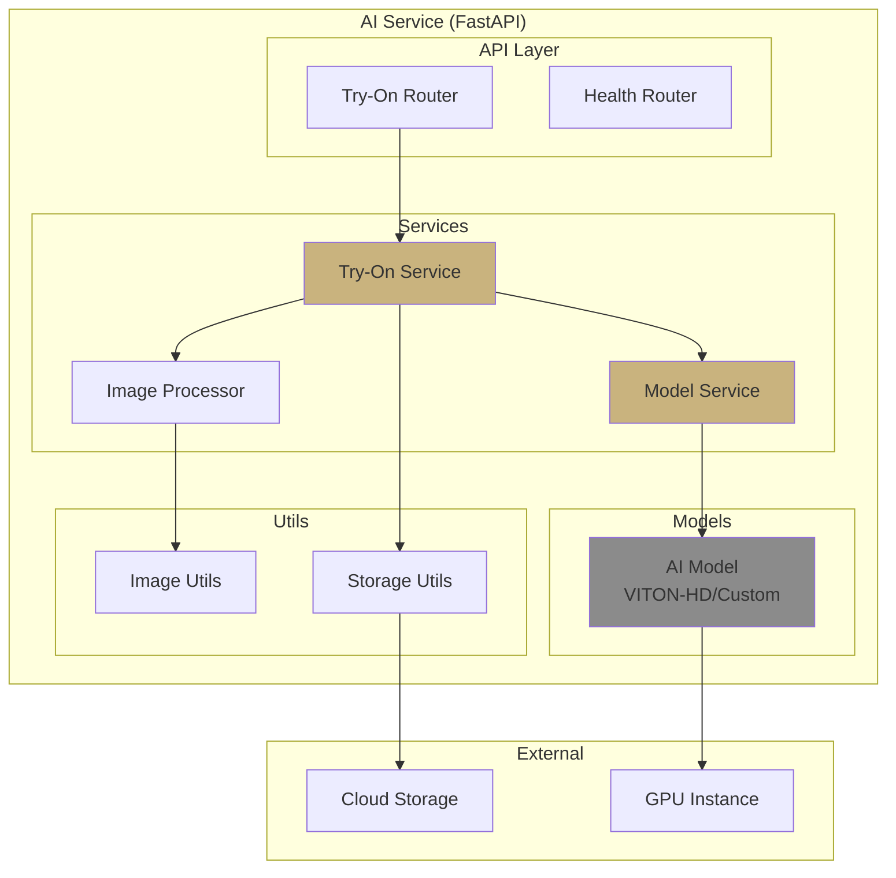
```mermaid
graph TB
    subgraph "AI Service (FastAPI)"
        subgraph "API Layer"
            TryOnRouter[Try-On Router]
            HealthRouter[Health Router]
        end

        subgraph "Services"
            TryOnService[Try-On Service]
            ImageProcessor[Image Processor]
            ModelService[Model Service]
        end

        subgraph "Models"
            AIModel[AI Model<br/>VITON-HD/Custom]
        end

        subgraph "Utils"
            ImageUtils[Image Utils]
            StorageUtils[Storage Utils]
        end
    end

    subgraph "External"
        CloudStorage[Cloud Storage]
        GPU[GPU Instance]
    end

    TryOnRouter --> TryOnService
    TryOnService --> ImageProcessor
    TryOnService --> ModelService
    TryOnService --> StorageUtils

    ImageProcessor --> ImageUtils
    ModelService --> AIModel

    AIModel --> GPU
    StorageUtils --> CloudStorage

    style TryOnService fill:#C9B37E
    style ModelService fill:#C9B37E
    style AIModel fill:#8B8B8B
```

### 5. Deployment Architecture

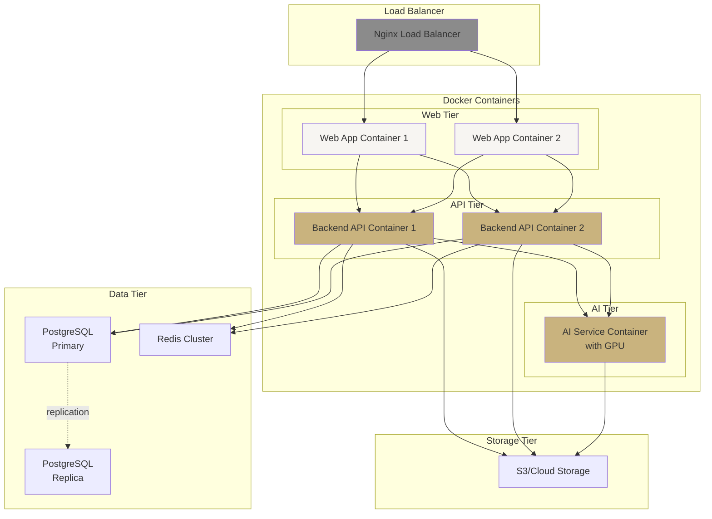
```mermaid
graph TB
    subgraph "Load Balancer"
        LB[Nginx Load Balancer]
    end

    subgraph "Docker Containers"
        subgraph "Web Tier"
            Web1[Web App Container 1]
            Web2[Web App Container 2]
        end

        subgraph "API Tier"
            API1[Backend API Container 1]
            API2[Backend API Container 2]
        end

        subgraph "AI Tier"
            AI1[AI Service Container<br/>with GPU]
        end
    end

    subgraph "Data Tier"
        PG[PostgreSQL<br/>Primary]
        PGReplica[PostgreSQL<br/>Replica]
        RedisCluster[Redis Cluster]
    end

    subgraph "Storage Tier"
        S3Bucket[S3/Cloud Storage]
    end

    LB --> Web1
    LB --> Web2

    Web1 --> API1
    Web1 --> API2
    Web2 --> API1
    Web2 --> API2

    API1 --> PG
    API2 --> PG
    API1 --> RedisCluster
    API2 --> RedisCluster
    API1 --> S3Bucket
    API2 --> S3Bucket

    API1 --> AI1
    API2 --> AI1

    AI1 --> S3Bucket

    PG -.replication.-> PGReplica

    style LB fill:#8B8B8B
    style Web1 fill:#F7F5F2
    style Web2 fill:#F7F5F2
    style API1 fill:#C9B37E
    style API2 fill:#C9B37E
    style AI1 fill:#C9B37E
```

---

## Diagram Legend

### Colors

- **Gold (#C9B37E)**: Core services/components
- **Ivory (#F7F5F2)**: Client applications
- **Gray (#8B8B8B)**: Infrastructure/external services

### Relationships

- **Solid lines**: Direct dependencies
- **Dashed lines**: Indirect/optional dependencies
- **Arrows**: Data/control flow direction

---

## Usage Notes

1. **Use Case Diagrams**: Show functional requirements from user perspective
2. **Class Diagrams**: Define data models and relationships
3. **Sequence Diagrams**: Illustrate time-ordered interactions
4. **Activity Diagrams**: Model business process workflows
5. **Component Diagrams**: Show system architecture and deployment

These diagrams should be updated as the system evolves and new features are added.
